# Projects and dependencies analysis

This document provides a comprehensive overview of the projects and their dependencies in the context of upgrading to .NETCoreApp,Version=v10.0.

## Table of Contents

- [Executive Summary](#executive-Summary)
  - [Highlevel Metrics](#highlevel-metrics)
  - [Projects Compatibility](#projects-compatibility)
  - [Package Compatibility](#package-compatibility)
  - [API Compatibility](#api-compatibility)
- [Aggregate NuGet packages details](#aggregate-nuget-packages-details)
- [Top API Migration Challenges](#top-api-migration-challenges)
  - [Technologies and Features](#technologies-and-features)
  - [Most Frequent API Issues](#most-frequent-api-issues)
- [Projects Relationship Graph](#projects-relationship-graph)
- [Project Details](#project-details)

  - [Implem.CodeDefiner.NetCore\Implem.CodeDefiner.NetCore.csproj](#implemcodedefinernetcoreimplemcodedefinernetcorecsproj)
  - [Implem.CodeDefiner.NetFramework\Implem.CodeDefiner.NetFramework.csproj](#implemcodedefinernetframeworkimplemcodedefinernetframeworkcsproj)
  - [Implem.CodeDefiner\Implem.CodeDefiner.csproj](#implemcodedefinerimplemcodedefinercsproj)
  - [Implem.DefinitionAccessor\Implem.DefinitionAccessor.csproj](#implemdefinitionaccessorimplemdefinitionaccessorcsproj)
  - [Implem.DisplayAccessor\Implem.DisplayAccessor.csproj](#implemdisplayaccessorimplemdisplayaccessorcsproj)
  - [Implem.Factory\Implem.Factory.csproj](#implemfactoryimplemfactorycsproj)
  - [Implem.Libraries\Implem.Libraries.csproj](#implemlibrariesimplemlibrariescsproj)
  - [Implem.ParameterAccessor\Implem.ParameterAccessor.csproj](#implemparameteraccessorimplemparameteraccessorcsproj)
  - [Implem.Pleasanter.NetCore\Implem.Pleasanter.NetCore.csproj](#implempleasanternetcoreimplempleasanternetcorecsproj)
  - [Implem.Pleasanter.NetFramework\Implem.Pleasanter.NetFramework.csproj](#implempleasanternetframeworkimplempleasanternetframeworkcsproj)
  - [Implem.Pleasanter\Implem.Pleasanter.csproj](#implempleasanterimplempleasantercsproj)
  - [Implem.SupportTools\Common\Implem.SupportTools.Common.csproj](#implemsupporttoolscommonimplemsupporttoolscommoncsproj)
  - [Implem.SupportTools\Launcher\Implem.SupportTools.csproj](#implemsupporttoolslauncherimplemsupporttoolscsproj)
  - [Implem.SupportTools\LdapSyncTester\Implem.SupportTools.LdapSyncTester.csproj](#implemsupporttoolsldapsynctesterimplemsupporttoolsldapsynctestercsproj)
  - [Implem.SupportTools\MailTester\Implem.SupportTools.MailTester.csproj](#implemsupporttoolsmailtesterimplemsupporttoolsmailtestercsproj)
  - [Implem.SupportTools\SysLogViewer\Implem.SupportTools.SysLogViewer.csproj](#implemsupporttoolssyslogviewerimplemsupporttoolssyslogviewercsproj)
  - [Rds\Implem.IRds\Implem.IRds.csproj](#rdsimplemirdsimplemirdscsproj)
  - [Rds\Implem.PostgreSql\Implem.PostgreSql.csproj](#rdsimplempostgresqlimplempostgresqlcsproj)
  - [Rds\Implem.SqlServer\Implem.SqlServer.csproj](#rdsimplemsqlserverimplemsqlservercsproj)

## Executive Summary

### Highlevel Metrics

| Metric | Count | Status |
| :--- | :---: | :--- |
| Total Projects | 19 | 13 require upgrade |
| Total NuGet Packages | 128 | 51 need upgrade |
| Total Code Files | 773 |  |
| Total Code Files with Incidents | 135 |  |
| Total Lines of Code | 284438 |  |
| Total Number of Issues | 2607 |  |
| Estimated LOC to modify | 2390+ | at least 0.8% of codebase |

### Projects Compatibility

| Project | Target Framework | Difficulty | Package Issues | API Issues | Est. LOC Impact | Description |
| :--- | :---: | :---: | :---: | :---: | :---: | :--- |
| [Implem.CodeDefiner.NetCore\Implem.CodeDefiner.NetCore.csproj](#implemcodedefinernetcoreimplemcodedefinernetcorecsproj) | netcoreapp2.2 | 🟢 Low | 1 | 0 |  | DotNetCoreApp, Sdk Style = True |
| [Implem.CodeDefiner.NetFramework\Implem.CodeDefiner.NetFramework.csproj](#implemcodedefinernetframeworkimplemcodedefinernetframeworkcsproj) | net472 | 🟢 Low | 6 | 0 |  | ClassicDotNetApp, Sdk Style = False |
| [Implem.CodeDefiner\Implem.CodeDefiner.csproj](#implemcodedefinerimplemcodedefinercsproj) | netstandard2.0 | 🟢 Low | 1 | 3 | 3+ | ClassLibrary, Sdk Style = True |
| [Implem.DefinitionAccessor\Implem.DefinitionAccessor.csproj](#implemdefinitionaccessorimplemdefinitionaccessorcsproj) | netstandard2.0 | ✅ None | 0 | 0 |  | ClassLibrary, Sdk Style = True |
| [Implem.DisplayAccessor\Implem.DisplayAccessor.csproj](#implemdisplayaccessorimplemdisplayaccessorcsproj) | netstandard2.0 | ✅ None | 0 | 0 |  | ClassLibrary, Sdk Style = True |
| [Implem.Factory\Implem.Factory.csproj](#implemfactoryimplemfactorycsproj) | netstandard2.0 | ✅ None | 0 | 0 |  | ClassLibrary, Sdk Style = True |
| [Implem.Libraries\Implem.Libraries.csproj](#implemlibrariesimplemlibrariescsproj) | netstandard2.0 | 🟢 Low | 8 | 4 | 4+ | ClassLibrary, Sdk Style = True |
| [Implem.ParameterAccessor\Implem.ParameterAccessor.csproj](#implemparameteraccessorimplemparameteraccessorcsproj) | netstandard2.0 | ✅ None | 0 | 0 |  | ClassLibrary, Sdk Style = True |
| [Implem.Pleasanter.NetCore\Implem.Pleasanter.NetCore.csproj](#implempleasanternetcoreimplempleasanternetcorecsproj) | netcoreapp2.2 | 🟡 Medium | 10 | 64 | 64+ | AspNetCore, Sdk Style = True |
| [Implem.Pleasanter.NetFramework\Implem.Pleasanter.NetFramework.csproj](#implempleasanternetframeworkimplempleasanternetframeworkcsproj) | net472 | 🔴 High | 104 | 1376 | 1376+ | Wap, Sdk Style = False |
| [Implem.Pleasanter\Implem.Pleasanter.csproj](#implempleasanterimplempleasantercsproj) | netstandard2.0 | 🟡 Medium | 54 | 444 | 444+ | ClassLibrary, Sdk Style = True |
| [Implem.SupportTools\Common\Implem.SupportTools.Common.csproj](#implemsupporttoolscommonimplemsupporttoolscommoncsproj) | net472 | 🟢 Low | 0 | 0 |  | ClassicClassLibrary, Sdk Style = False |
| [Implem.SupportTools\Launcher\Implem.SupportTools.csproj](#implemsupporttoolslauncherimplemsupporttoolscsproj) | net10.0-windows | ✅ None | 0 | 0 |  | Wpf, Sdk Style = True |
| [Implem.SupportTools\LdapSyncTester\Implem.SupportTools.LdapSyncTester.csproj](#implemsupporttoolsldapsynctesterimplemsupporttoolsldapsynctestercsproj) | net472 | 🟢 Low | 3 | 79 | 79+ | ClassicWpf, Sdk Style = False |
| [Implem.SupportTools\MailTester\Implem.SupportTools.MailTester.csproj](#implemsupporttoolsmailtesterimplemsupporttoolsmailtestercsproj) | net472 | 🟢 Low | 3 | 32 | 32+ | ClassicWpf, Sdk Style = False |
| [Implem.SupportTools\SysLogViewer\Implem.SupportTools.SysLogViewer.csproj](#implemsupporttoolssyslogviewerimplemsupporttoolssyslogviewercsproj) | net472 | 🟡 Medium | 3 | 156 | 156+ | ClassicWpf, Sdk Style = False |
| [Rds\Implem.IRds\Implem.IRds.csproj](#rdsimplemirdsimplemirdscsproj) | netstandard2.0 | ✅ None | 0 | 0 |  | ClassLibrary, Sdk Style = True |
| [Rds\Implem.PostgreSql\Implem.PostgreSql.csproj](#rdsimplempostgresqlimplempostgresqlcsproj) | netstandard2.0 | 🟢 Low | 1 | 0 |  | ClassLibrary, Sdk Style = True |
| [Rds\Implem.SqlServer\Implem.SqlServer.csproj](#rdsimplemsqlserverimplemsqlservercsproj) | netstandard2.0 | 🟢 Low | 3 | 232 | 232+ | ClassLibrary, Sdk Style = True |

### Package Compatibility

| Status | Count | Percentage |
| :--- | :---: | :---: |
| ✅ Compatible | 77 | 60.2% |
| ⚠️ Incompatible | 24 | 18.8% |
| 🔄 Upgrade Recommended | 27 | 21.1% |
| ***Total NuGet Packages*** | ***128*** | ***100%*** |

### API Compatibility

| Category | Count | Impact |
| :--- | :---: | :--- |
| 🔴 Binary Incompatible | 1760 | High - Require code changes |
| 🟡 Source Incompatible | 591 | Medium - Needs re-compilation and potential conflicting API error fixing |
| 🔵 Behavioral change | 39 | Low - Behavioral changes that may require testing at runtime |
| ✅ Compatible | 168288 |  |
| ***Total APIs Analyzed*** | ***170678*** |  |

## Aggregate NuGet packages details

| Package | Current Version | Suggested Version | Projects | Description |
| :--- | :---: | :---: | :--- | :--- |
| Antlr | 3.5.0.2 |  | [Implem.Pleasanter.NetFramework.csproj](#implempleasanternetframeworkimplempleasanternetframeworkcsproj) | Needs to be replaced with Replace with new package Antlr4=4.6.6 |
| Antlr3.Runtime | 3.5.1 |  | [Implem.Pleasanter.csproj](#implempleasanterimplempleasantercsproj) | ✅Compatible |
| AspNetCoreCurrentRequestContext | 2.0.0 |  | [Implem.Pleasanter.NetCore.csproj](#implempleasanternetcoreimplempleasanternetcorecsproj) | ✅Compatible |
| BuildBundlerMinifier | 3.2.435 |  | [Implem.Pleasanter.csproj](#implempleasanterimplempleasantercsproj) | ✅Compatible |
| ClosedXML | 0.92.1 |  | [Implem.Pleasanter.csproj](#implempleasanterimplempleasantercsproj) [Implem.Pleasanter.NetFramework.csproj](#implempleasanternetframeworkimplempleasanternetframeworkcsproj) | ✅Compatible |
| CommonServiceLocator | 2.0.4 |  | [Implem.SupportTools.csproj](#implemsupporttoolslauncherimplemsupporttoolscsproj) [Implem.SupportTools.LdapSyncTester.csproj](#implemsupporttoolsldapsynctesterimplemsupporttoolsldapsynctestercsproj) [Implem.SupportTools.MailTester.csproj](#implemsupporttoolsmailtesterimplemsupporttoolsmailtestercsproj) [Implem.SupportTools.SysLogViewer.csproj](#implemsupporttoolssyslogviewerimplemsupporttoolssyslogviewercsproj) | ✅Compatible |
| CsvHelper | 12.1.2 |  | [Implem.Libraries.csproj](#implemlibrariesimplemlibrariescsproj) [Implem.Pleasanter.NetFramework.csproj](#implempleasanternetframeworkimplempleasanternetframeworkcsproj) | ✅Compatible |
| Dapper | 1.50.2 |  | [Implem.SupportTools.SysLogViewer.csproj](#implemsupporttoolssyslogviewerimplemsupporttoolssyslogviewercsproj) | ✅Compatible |
| DocumentFormat.OpenXml | 2.9.0 |  | [Implem.CodeDefiner.NetFramework.csproj](#implemcodedefinernetframeworkimplemcodedefinernetframeworkcsproj) [Implem.Pleasanter.csproj](#implempleasanterimplempleasantercsproj) [Implem.Pleasanter.NetFramework.csproj](#implempleasanternetframeworkimplempleasanternetframeworkcsproj) | ✅Compatible |
| DocumentFormat.OpenXml | 2.9.0.0 |  | [Implem.Libraries.csproj](#implemlibrariesimplemlibrariescsproj) | ✅Compatible |
| ExcelNumberFormat | 1.0.3 |  | [Implem.Pleasanter.csproj](#implempleasanterimplempleasantercsproj) [Implem.Pleasanter.NetFramework.csproj](#implempleasanternetframeworkimplempleasanternetframeworkcsproj) | ✅Compatible |
| FastMember | 1.4.1 |  | [Implem.Pleasanter.csproj](#implempleasanterimplempleasantercsproj) [Implem.Pleasanter.NetFramework.csproj](#implempleasanternetframeworkimplempleasanternetframeworkcsproj) | ✅Compatible |
| FastMember.Signed | 1.4.1 |  | [Implem.Pleasanter.csproj](#implempleasanterimplempleasantercsproj) [Implem.Pleasanter.NetFramework.csproj](#implempleasanternetframeworkimplempleasanternetframeworkcsproj) | ✅Compatible |
| Microsoft.AspNet.Mvc | 5.2.7 |  | [Implem.Pleasanter.csproj](#implempleasanterimplempleasantercsproj) [Implem.Pleasanter.NetFramework.csproj](#implempleasanternetframeworkimplempleasanternetframeworkcsproj) | ⚠️NuGet パッケージに互換性がありません |
| Microsoft.AspNet.Mvc.FixedDisplayModes | 5.0.0 |  | [Implem.Pleasanter.NetFramework.csproj](#implempleasanternetframeworkimplempleasanternetframeworkcsproj) | ✅Compatible |
| Microsoft.AspNet.Mvc.ja | 5.2.7 |  | [Implem.Pleasanter.NetFramework.csproj](#implempleasanternetframeworkimplempleasanternetframeworkcsproj) | ⚠️NuGet パッケージに互換性がありません |
| Microsoft.AspNet.Razor | 3.2.7 |  | [Implem.Pleasanter.NetFramework.csproj](#implempleasanternetframeworkimplempleasanternetframeworkcsproj) | NuGet パッケージの機能は、フレームワークの参照に含まれています |
| Microsoft.AspNet.Razor.ja | 3.2.7 |  | [Implem.Pleasanter.NetFramework.csproj](#implempleasanternetframeworkimplempleasanternetframeworkcsproj) | ⚠️NuGet パッケージに互換性がありません |
| Microsoft.AspNet.SessionState.SessionStateModule | 1.1.0 |  | [Implem.Pleasanter.NetFramework.csproj](#implempleasanternetframeworkimplempleasanternetframeworkcsproj) | NuGet パッケージの機能は、フレームワークの参照に含まれています |
| Microsoft.AspNet.Web.Optimization | 1.1.3 |  | [Implem.Pleasanter.NetFramework.csproj](#implempleasanternetframeworkimplempleasanternetframeworkcsproj) | ⚠️NuGet パッケージに互換性がありません |
| Microsoft.AspNet.Web.Optimization.ja | 1.1.3 |  | [Implem.Pleasanter.NetFramework.csproj](#implempleasanternetframeworkimplempleasanternetframeworkcsproj) | ⚠️NuGet パッケージに互換性がありません |
| Microsoft.AspNet.WebApi | 5.2.7 |  | [Implem.Pleasanter.NetFramework.csproj](#implempleasanternetframeworkimplempleasanternetframeworkcsproj) | NuGet パッケージの機能は、フレームワークの参照に含まれています |
| Microsoft.AspNet.WebApi.Client | 5.2.7 |  | [Implem.Pleasanter.NetFramework.csproj](#implempleasanternetframeworkimplempleasanternetframeworkcsproj) | ✅Compatible |
| Microsoft.AspNet.WebApi.Client.ja | 5.2.7 | 6.0.0 | [Implem.Pleasanter.NetFramework.csproj](#implempleasanternetframeworkimplempleasanternetframeworkcsproj) | ⚠️NuGet パッケージに互換性がありません |
| Microsoft.AspNet.WebApi.Core | 5.2.7 |  | [Implem.Pleasanter.NetFramework.csproj](#implempleasanternetframeworkimplempleasanternetframeworkcsproj) | ⚠️NuGet パッケージに互換性がありません |
| Microsoft.AspNet.WebApi.Core.ja | 5.2.7 |  | [Implem.Pleasanter.NetFramework.csproj](#implempleasanternetframeworkimplempleasanternetframeworkcsproj) | ⚠️NuGet パッケージに互換性がありません |
| Microsoft.AspNet.WebApi.WebHost | 5.2.7 |  | [Implem.Pleasanter.NetFramework.csproj](#implempleasanternetframeworkimplempleasanternetframeworkcsproj) | ⚠️NuGet パッケージに互換性がありません |
| Microsoft.AspNet.WebApi.WebHost.ja | 5.2.7 |  | [Implem.Pleasanter.NetFramework.csproj](#implempleasanternetframeworkimplempleasanternetframeworkcsproj) | ⚠️NuGet パッケージに互換性がありません |
| Microsoft.AspNet.WebPages | 3.2.7 |  | [Implem.Pleasanter.NetFramework.csproj](#implempleasanternetframeworkimplempleasanternetframeworkcsproj) | NuGet パッケージの機能は、フレームワークの参照に含まれています |
| Microsoft.AspNet.WebPages.ja | 3.2.7 |  | [Implem.Pleasanter.NetFramework.csproj](#implempleasanternetframeworkimplempleasanternetframeworkcsproj) | ⚠️NuGet パッケージに互換性がありません |
| Microsoft.AspNetCore.All | 2.2.1 | 2.2.8 | [Implem.Pleasanter.NetCore.csproj](#implempleasanternetcoreimplempleasanternetcorecsproj) | NuGet パッケージにセキュリティの脆弱性が含まれています |
| Microsoft.AspNetCore.App |  |  | [Implem.Pleasanter.NetCore.csproj](#implempleasanternetcoreimplempleasanternetcorecsproj) | NuGet パッケージの機能は、フレームワークの参照に含まれています |
| Microsoft.AspNetCore.Razor.Design | 2.2.0 |  | [Implem.Pleasanter.NetCore.csproj](#implempleasanternetcoreimplempleasanternetcorecsproj) | NuGet パッケージの機能は、フレームワークの参照に含まれています |
| Microsoft.Bcl | 1.1.10 |  | [Implem.Pleasanter.NetFramework.csproj](#implempleasanternetframeworkimplempleasanternetframeworkcsproj) | ⚠️NuGet パッケージに互換性がありません |
| Microsoft.Bcl.Build | 1.0.21 |  | [Implem.Pleasanter.NetFramework.csproj](#implempleasanternetframeworkimplempleasanternetframeworkcsproj) | ✅Compatible |
| Microsoft.CSharp | 4.5.0 | 4.7.0 | [Implem.Pleasanter.csproj](#implempleasanterimplempleasantercsproj) | NuGet パッケージのアップグレードをおすすめします |
| Microsoft.Extensions.Caching.Abstractions | 2.2.0 | 10.0.1 | [Implem.Pleasanter.csproj](#implempleasanterimplempleasantercsproj) [Implem.Pleasanter.NetCore.csproj](#implempleasanternetcoreimplempleasanternetcorecsproj) [Implem.Pleasanter.NetFramework.csproj](#implempleasanternetframeworkimplempleasanternetframeworkcsproj) | NuGet パッケージのアップグレードをおすすめします |
| Microsoft.Extensions.Caching.Memory | 2.2.0 | 10.0.1 | [Implem.Pleasanter.csproj](#implempleasanterimplempleasantercsproj) [Implem.Pleasanter.NetCore.csproj](#implempleasanternetcoreimplempleasanternetcorecsproj) [Implem.Pleasanter.NetFramework.csproj](#implempleasanternetframeworkimplempleasanternetframeworkcsproj) | NuGet パッケージのアップグレードをおすすめします |
| Microsoft.Extensions.DependencyInjection.Abstractions | 2.2.0 | 10.0.1 | [Implem.Pleasanter.csproj](#implempleasanterimplempleasantercsproj) [Implem.Pleasanter.NetFramework.csproj](#implempleasanternetframeworkimplempleasanternetframeworkcsproj) | NuGet パッケージのアップグレードをおすすめします |
| Microsoft.Extensions.Logging | 1.0.0 | 10.0.1 | [Implem.Pleasanter.NetFramework.csproj](#implempleasanternetframeworkimplempleasanternetframeworkcsproj) | NuGet パッケージのアップグレードをおすすめします |
| Microsoft.Extensions.Logging.Abstractions | 1.0.0 | 10.0.1 | [Implem.Pleasanter.NetFramework.csproj](#implempleasanternetframeworkimplempleasanternetframeworkcsproj) | NuGet パッケージのアップグレードをおすすめします |
| Microsoft.Extensions.Logging.Debug | 1.0.0 | 10.0.1 | [Implem.Pleasanter.NetFramework.csproj](#implempleasanternetframeworkimplempleasanternetframeworkcsproj) | NuGet パッケージのアップグレードをおすすめします |
| Microsoft.Extensions.Options | 2.2.0 | 10.0.1 | [Implem.Pleasanter.csproj](#implempleasanterimplempleasantercsproj) [Implem.Pleasanter.NetFramework.csproj](#implempleasanternetframeworkimplempleasanternetframeworkcsproj) | NuGet パッケージのアップグレードをおすすめします |
| Microsoft.Extensions.Primitives | 2.2.0 | 10.0.1 | [Implem.Pleasanter.csproj](#implempleasanterimplempleasantercsproj) [Implem.Pleasanter.NetFramework.csproj](#implempleasanternetframeworkimplempleasanternetframeworkcsproj) | NuGet パッケージのアップグレードをおすすめします |
| Microsoft.IdentityModel.Logging | 5.4.0 |  | [Implem.Pleasanter.csproj](#implempleasanterimplempleasantercsproj) [Implem.Pleasanter.NetFramework.csproj](#implempleasanternetframeworkimplempleasanternetframeworkcsproj) | ⚠️NuGet パッケージは非推奨です |
| Microsoft.IdentityModel.Protocols | 5.4.0 |  | [Implem.Pleasanter.csproj](#implempleasanterimplempleasantercsproj) [Implem.Pleasanter.NetFramework.csproj](#implempleasanternetframeworkimplempleasanternetframeworkcsproj) | ⚠️NuGet パッケージは非推奨です |
| Microsoft.IdentityModel.Tokens | 5.4.0 |  | [Implem.Pleasanter.csproj](#implempleasanterimplempleasantercsproj) [Implem.Pleasanter.NetFramework.csproj](#implempleasanternetframeworkimplempleasanternetframeworkcsproj) | ⚠️NuGet パッケージは非推奨です |
| Microsoft.IdentityModel.Tokens.Saml | 5.4.0 |  | [Implem.Pleasanter.csproj](#implempleasanterimplempleasantercsproj) [Implem.Pleasanter.NetFramework.csproj](#implempleasanternetframeworkimplempleasanternetframeworkcsproj) | ⚠️NuGet パッケージは非推奨です |
| Microsoft.IdentityModel.Xml | 5.4.0 |  | [Implem.Pleasanter.csproj](#implempleasanterimplempleasantercsproj) [Implem.Pleasanter.NetFramework.csproj](#implempleasanternetframeworkimplempleasanternetframeworkcsproj) | ⚠️NuGet パッケージは非推奨です |
| Microsoft.Net.Http | 2.2.29 |  | [Implem.Pleasanter.NetFramework.csproj](#implempleasanternetframeworkimplempleasanternetframeworkcsproj) | Needs to be replaced with Replace with new package System.Net.Http=4.3.4 |
| Microsoft.NETCore.App |  |  | [Implem.CodeDefiner.NetCore.csproj](#implemcodedefinernetcoreimplemcodedefinernetcorecsproj) [Implem.Pleasanter.NetCore.csproj](#implempleasanternetcoreimplempleasanternetcorecsproj) | ✅Compatible |
| Microsoft.Web.Infrastructure | 1.0.0 |  | [Implem.Pleasanter.csproj](#implempleasanterimplempleasantercsproj) | ⚠️NuGet パッケージに互換性がありません |
| Microsoft.Web.Infrastructure | 1.0.0.0 |  | [Implem.Pleasanter.NetFramework.csproj](#implempleasanternetframeworkimplempleasanternetframeworkcsproj) | NuGet パッケージの機能は、フレームワークの参照に含まれています |
| Microsoft.Web.RedisSessionStateProvider | 4.0.1 |  | [Implem.Pleasanter.NetFramework.csproj](#implempleasanternetframeworkimplempleasanternetframeworkcsproj) | ⚠️NuGet パッケージに互換性がありません |
| NETStandard.Library | 2.0.3 |  | [Implem.CodeDefiner.csproj](#implemcodedefinerimplemcodedefinercsproj) [Implem.DefinitionAccessor.csproj](#implemdefinitionaccessorimplemdefinitionaccessorcsproj) [Implem.DisplayAccessor.csproj](#implemdisplayaccessorimplemdisplayaccessorcsproj) [Implem.Factory.csproj](#implemfactoryimplemfactorycsproj) [Implem.IRds.csproj](#rdsimplemirdsimplemirdscsproj) [Implem.Libraries.csproj](#implemlibrariesimplemlibrariescsproj) [Implem.ParameterAccessor.csproj](#implemparameteraccessorimplemparameteraccessorcsproj) [Implem.Pleasanter.csproj](#implempleasanterimplempleasantercsproj) [Implem.PostgreSql.csproj](#rdsimplempostgresqlimplempostgresqlcsproj) [Implem.SqlServer.csproj](#rdsimplemsqlserverimplemsqlservercsproj) | ✅Compatible |
| Newtonsoft.Json | 12.0.1 | 13.0.4 | [Implem.CodeDefiner.NetFramework.csproj](#implemcodedefinernetframeworkimplemcodedefinernetframeworkcsproj) [Implem.Libraries.csproj](#implemlibrariesimplemlibrariescsproj) [Implem.Pleasanter.csproj](#implempleasanterimplempleasantercsproj) [Implem.Pleasanter.NetFramework.csproj](#implempleasanternetframeworkimplempleasanternetframeworkcsproj) [Implem.SupportTools.LdapSyncTester.csproj](#implemsupporttoolsldapsynctesterimplemsupporttoolsldapsynctestercsproj) [Implem.SupportTools.MailTester.csproj](#implemsupporttoolsmailtesterimplemsupporttoolsmailtestercsproj) [Implem.SupportTools.SysLogViewer.csproj](#implemsupporttoolssyslogviewerimplemsupporttoolssyslogviewercsproj) | NuGet パッケージのアップグレードをおすすめします |
| Newtonsoft.Json | 13.0.4 |  | [Implem.SupportTools.csproj](#implemsupporttoolslauncherimplemsupporttoolscsproj) | ✅Compatible |
| Novell.Directory.Ldap.NETStandard | 2.3.8 |  | [Implem.Pleasanter.csproj](#implempleasanterimplempleasantercsproj) [Implem.Pleasanter.NetFramework.csproj](#implempleasanternetframeworkimplempleasanternetframeworkcsproj) | ✅Compatible |
| Npgsql | 4.0.7 | 10.0.1 | [Implem.Pleasanter.NetFramework.csproj](#implempleasanternetframeworkimplempleasanternetframeworkcsproj) [Implem.PostgreSql.csproj](#rdsimplempostgresqlimplempostgresqlcsproj) | NuGet パッケージにセキュリティの脆弱性が含まれています |
| Pipelines.Sockets.Unofficial | 1.0.9 |  | [Implem.Pleasanter.csproj](#implempleasanterimplempleasantercsproj) [Implem.Pleasanter.NetFramework.csproj](#implempleasanternetframeworkimplempleasanternetframeworkcsproj) | ✅Compatible |
| Prism.Core | 7.1.0.431 |  | [Implem.SupportTools.LdapSyncTester.csproj](#implemsupporttoolsldapsynctesterimplemsupporttoolsldapsynctestercsproj) [Implem.SupportTools.MailTester.csproj](#implemsupporttoolsmailtesterimplemsupporttoolsmailtestercsproj) [Implem.SupportTools.SysLogViewer.csproj](#implemsupporttoolssyslogviewerimplemsupporttoolssyslogviewercsproj) | ✅Compatible |
| Prism.Core | 8.1.97 |  | [Implem.SupportTools.csproj](#implemsupporttoolslauncherimplemsupporttoolscsproj) | ✅Compatible |
| Prism.Wpf | 7.1.0.431 | 8.1.97 | [Implem.SupportTools.LdapSyncTester.csproj](#implemsupporttoolsldapsynctesterimplemsupporttoolsldapsynctestercsproj) [Implem.SupportTools.MailTester.csproj](#implemsupporttoolsmailtesterimplemsupporttoolsmailtestercsproj) [Implem.SupportTools.SysLogViewer.csproj](#implemsupporttoolssyslogviewerimplemsupporttoolssyslogviewercsproj) | ⚠️NuGet パッケージに互換性がありません |
| Prism.Wpf | 8.1.97 |  | [Implem.SupportTools.csproj](#implemsupporttoolslauncherimplemsupporttoolscsproj) | ✅Compatible |
| Sendgrid | 6.3.4 |  | [Implem.Pleasanter.csproj](#implempleasanterimplempleasantercsproj) | ✅Compatible |
| Sendgrid | 9.10.0 |  | [Implem.Pleasanter.NetFramework.csproj](#implempleasanternetframeworkimplempleasanternetframeworkcsproj) | ✅Compatible |
| SendGrid.SmtpApi | 1.3.3 |  | [Implem.Pleasanter.csproj](#implempleasanterimplempleasantercsproj) [Implem.Pleasanter.NetFramework.csproj](#implempleasanternetframeworkimplempleasanternetframeworkcsproj) | ✅Compatible |
| StackExchange.Redis | 2.0.519 |  | [Implem.Pleasanter.csproj](#implempleasanterimplempleasantercsproj) [Implem.Pleasanter.NetFramework.csproj](#implempleasanternetframeworkimplempleasanternetframeworkcsproj) | ✅Compatible |
| StackExchange.Redis.StrongName | 1.2.6 |  | [Implem.Pleasanter.csproj](#implempleasanterimplempleasantercsproj) [Implem.Pleasanter.NetFramework.csproj](#implempleasanternetframeworkimplempleasanternetframeworkcsproj) | ⚠️NuGet パッケージは非推奨です |
| Sustainsys.Saml2 | 2.2.0 | 2.11.0 | [Implem.Pleasanter.csproj](#implempleasanterimplempleasantercsproj) [Implem.Pleasanter.NetFramework.csproj](#implempleasanternetframeworkimplempleasanternetframeworkcsproj) | NuGet パッケージにセキュリティの脆弱性が含まれています |
| Sustainsys.Saml2.Mvc | 2.2.0 |  | [Implem.Pleasanter.csproj](#implempleasanterimplempleasantercsproj) [Implem.Pleasanter.NetFramework.csproj](#implempleasanternetframeworkimplempleasanternetframeworkcsproj) | ⚠️NuGet パッケージに互換性がありません |
| System.Buffers | 4.5.0 |  | [Implem.Pleasanter.csproj](#implempleasanterimplempleasantercsproj) [Implem.Pleasanter.NetFramework.csproj](#implempleasanternetframeworkimplempleasanternetframeworkcsproj) | NuGet パッケージの機能は、フレームワークの参照に含まれています |
| System.Collections | 4.0.11 |  | [Implem.Pleasanter.NetFramework.csproj](#implempleasanternetframeworkimplempleasanternetframeworkcsproj) | NuGet パッケージの機能は、フレームワークの参照に含まれています |
| System.Collections.Concurrent | 4.0.12 |  | [Implem.Pleasanter.NetFramework.csproj](#implempleasanternetframeworkimplempleasanternetframeworkcsproj) | NuGet パッケージの機能は、フレームワークの参照に含まれています |
| System.Collections.NonGeneric | 4.0.1 |  | [Implem.Pleasanter.NetFramework.csproj](#implempleasanternetframeworkimplempleasanternetframeworkcsproj) | NuGet パッケージの機能は、フレームワークの参照に含まれています |
| System.ComponentModel.Annotations | 4.5.0 |  | [Implem.Pleasanter.csproj](#implempleasanterimplempleasantercsproj) [Implem.Pleasanter.NetFramework.csproj](#implempleasanternetframeworkimplempleasanternetframeworkcsproj) | NuGet パッケージの機能は、フレームワークの参照に含まれています |
| System.ComponentModel.Composition | 4.5.0 | 10.0.1 | [Implem.Pleasanter.csproj](#implempleasanterimplempleasantercsproj) | NuGet パッケージのアップグレードをおすすめします |
| System.Configuration.ConfigurationManager | 4.5.0 | 10.0.1 | [Implem.Pleasanter.csproj](#implempleasanterimplempleasantercsproj) [Implem.Pleasanter.NetFramework.csproj](#implempleasanternetframeworkimplempleasanternetframeworkcsproj) | NuGet パッケージのアップグレードをおすすめします |
| System.Console | 4.0.0 |  | [Implem.Pleasanter.NetFramework.csproj](#implempleasanternetframeworkimplempleasanternetframeworkcsproj) | NuGet パッケージの機能は、フレームワークの参照に含まれています |
| System.Data.DataSetExtensions | 4.5.0 |  | [Implem.CodeDefiner.csproj](#implemcodedefinerimplemcodedefinercsproj) [Implem.Libraries.csproj](#implemlibrariesimplemlibrariescsproj) [Implem.Pleasanter.csproj](#implempleasanterimplempleasantercsproj) [Implem.Pleasanter.NetFramework.csproj](#implempleasanternetframeworkimplempleasanternetframeworkcsproj) [Implem.SqlServer.csproj](#rdsimplemsqlserverimplemsqlservercsproj) | NuGet パッケージの機能は、フレームワークの参照に含まれています |
| System.Data.SqlClient | 4.6.0 | 4.9.0 | [Implem.CodeDefiner.NetFramework.csproj](#implemcodedefinernetframeworkimplemcodedefinernetframeworkcsproj) [Implem.Pleasanter.NetFramework.csproj](#implempleasanternetframeworkimplempleasanternetframeworkcsproj) [Implem.SqlServer.csproj](#rdsimplemsqlserverimplemsqlservercsproj) | NuGet パッケージにセキュリティの脆弱性が含まれています |
| System.Diagnostics.Debug | 4.0.11 |  | [Implem.Pleasanter.NetFramework.csproj](#implempleasanternetframeworkimplempleasanternetframeworkcsproj) | NuGet パッケージの機能は、フレームワークの参照に含まれています |
| System.Diagnostics.PerformanceCounter | 4.5.0 | 10.0.1 | [Implem.Pleasanter.csproj](#implempleasanterimplempleasantercsproj) [Implem.Pleasanter.NetFramework.csproj](#implempleasanternetframeworkimplempleasanternetframeworkcsproj) | NuGet パッケージのアップグレードをおすすめします |
| System.DirectoryServices | 4.5.0 | 10.0.1 | [Implem.Pleasanter.csproj](#implempleasanterimplempleasantercsproj) | NuGet パッケージのアップグレードをおすすめします |
| System.Drawing.Common | 4.5.1 | 10.0.1 | [Implem.Libraries.csproj](#implemlibrariesimplemlibrariescsproj) [Implem.Pleasanter.csproj](#implempleasanterimplempleasantercsproj) [Implem.Pleasanter.NetFramework.csproj](#implempleasanternetframeworkimplempleasanternetframeworkcsproj) | NuGet パッケージのアップグレードをおすすめします |
| System.Globalization | 4.0.11 |  | [Implem.Pleasanter.NetFramework.csproj](#implempleasanternetframeworkimplempleasanternetframeworkcsproj) | NuGet パッケージの機能は、フレームワークの参照に含まれています |
| System.IO | 4.3.0 |  | [Implem.Pleasanter.csproj](#implempleasanterimplempleasantercsproj) [Implem.Pleasanter.NetFramework.csproj](#implempleasanternetframeworkimplempleasanternetframeworkcsproj) | NuGet パッケージの機能は、フレームワークの参照に含まれています |
| System.IO.Compression | 4.3.0 |  | [Implem.Pleasanter.csproj](#implempleasanterimplempleasantercsproj) [Implem.Pleasanter.NetFramework.csproj](#implempleasanternetframeworkimplempleasanternetframeworkcsproj) | NuGet パッケージの機能は、フレームワークの参照に含まれています |
| System.IO.FileSystem | 4.0.1 |  | [Implem.Pleasanter.NetFramework.csproj](#implempleasanternetframeworkimplempleasanternetframeworkcsproj) | NuGet パッケージの機能は、フレームワークの参照に含まれています |
| System.IO.FileSystem.Primitives | 4.3.0 |  | [Implem.CodeDefiner.NetFramework.csproj](#implemcodedefinernetframeworkimplemcodedefinernetframeworkcsproj) [Implem.Libraries.csproj](#implemlibrariesimplemlibrariescsproj) [Implem.Pleasanter.csproj](#implempleasanterimplempleasantercsproj) [Implem.Pleasanter.NetFramework.csproj](#implempleasanternetframeworkimplempleasanternetframeworkcsproj) | NuGet パッケージの機能は、フレームワークの参照に含まれています |
| System.IO.Packaging | 4.5.0 | 10.0.1 | [Implem.CodeDefiner.NetFramework.csproj](#implemcodedefinernetframeworkimplemcodedefinernetframeworkcsproj) [Implem.Libraries.csproj](#implemlibrariesimplemlibrariescsproj) [Implem.Pleasanter.csproj](#implempleasanterimplempleasantercsproj) [Implem.Pleasanter.NetFramework.csproj](#implempleasanternetframeworkimplempleasanternetframeworkcsproj) | NuGet パッケージのアップグレードをおすすめします |
| System.IO.Pipelines | 4.5.3 | 10.0.1 | [Implem.Pleasanter.csproj](#implempleasanterimplempleasantercsproj) [Implem.Pleasanter.NetFramework.csproj](#implempleasanternetframeworkimplempleasanternetframeworkcsproj) | NuGet パッケージのアップグレードをおすすめします |
| System.Linq | 4.1.0 |  | [Implem.Pleasanter.NetFramework.csproj](#implempleasanternetframeworkimplempleasanternetframeworkcsproj) | NuGet パッケージの機能は、フレームワークの参照に含まれています |
| System.Memory | 4.5.3 |  | [Implem.Pleasanter.csproj](#implempleasanterimplempleasantercsproj) [Implem.Pleasanter.NetFramework.csproj](#implempleasanternetframeworkimplempleasanternetframeworkcsproj) | NuGet パッケージの機能は、フレームワークの参照に含まれています |
| System.Net.Http | 4.3.4 |  | [Implem.Pleasanter.csproj](#implempleasanterimplempleasantercsproj) [Implem.Pleasanter.NetFramework.csproj](#implempleasanternetframeworkimplempleasanternetframeworkcsproj) | NuGet パッケージの機能は、フレームワークの参照に含まれています |
| System.Net.NameResolution | 4.0.0 |  | [Implem.Pleasanter.NetFramework.csproj](#implempleasanternetframeworkimplempleasanternetframeworkcsproj) | NuGet パッケージの機能は、フレームワークの参照に含まれています |
| System.Net.Requests | 4.0.11 |  | [Implem.Pleasanter.NetFramework.csproj](#implempleasanternetframeworkimplempleasanternetframeworkcsproj) | NuGet パッケージの機能は、フレームワークの参照に含まれています |
| System.Net.Security | 4.0.0 |  | [Implem.Pleasanter.NetFramework.csproj](#implempleasanternetframeworkimplempleasanternetframeworkcsproj) | NuGet パッケージの機能は、フレームワークの参照に含まれています |
| System.Net.Sockets | 4.1.0 |  | [Implem.Pleasanter.NetFramework.csproj](#implempleasanternetframeworkimplempleasanternetframeworkcsproj) | NuGet パッケージの機能は、フレームワークの参照に含まれています |
| System.Numerics.Vectors | 4.5.0 |  | [Implem.Pleasanter.csproj](#implempleasanterimplempleasantercsproj) [Implem.Pleasanter.NetFramework.csproj](#implempleasanternetframeworkimplempleasanternetframeworkcsproj) | NuGet パッケージの機能は、フレームワークの参照に含まれています |
| System.Reflection | 4.1.0 |  | [Implem.Pleasanter.NetFramework.csproj](#implempleasanternetframeworkimplempleasanternetframeworkcsproj) | NuGet パッケージの機能は、フレームワークの参照に含まれています |
| System.Reflection.Extensions | 4.0.1 |  | [Implem.Pleasanter.NetFramework.csproj](#implempleasanternetframeworkimplempleasanternetframeworkcsproj) | NuGet パッケージの機能は、フレームワークの参照に含まれています |
| System.Reflection.Primitives | 4.0.1 |  | [Implem.Pleasanter.NetFramework.csproj](#implempleasanternetframeworkimplempleasanternetframeworkcsproj) | NuGet パッケージの機能は、フレームワークの参照に含まれています |
| System.Reflection.TypeExtensions | 4.1.0 |  | [Implem.Pleasanter.NetFramework.csproj](#implempleasanternetframeworkimplempleasanternetframeworkcsproj) | NuGet パッケージの機能は、フレームワークの参照に含まれています |
| System.Resources.ResourceManager | 4.0.1 |  | [Implem.Pleasanter.NetFramework.csproj](#implempleasanternetframeworkimplempleasanternetframeworkcsproj) | NuGet パッケージの機能は、フレームワークの参照に含まれています |
| System.Runtime | 4.3.0 |  | [Implem.Pleasanter.csproj](#implempleasanterimplempleasantercsproj) [Implem.Pleasanter.NetFramework.csproj](#implempleasanternetframeworkimplempleasanternetframeworkcsproj) | NuGet パッケージの機能は、フレームワークの参照に含まれています |
| System.Runtime.CompilerServices.Unsafe | 4.5.2 | 6.1.2 | [Implem.Pleasanter.csproj](#implempleasanterimplempleasantercsproj) [Implem.Pleasanter.NetFramework.csproj](#implempleasanternetframeworkimplempleasanternetframeworkcsproj) | NuGet パッケージのアップグレードをおすすめします |
| System.Runtime.Extensions | 4.1.0 |  | [Implem.Pleasanter.NetFramework.csproj](#implempleasanternetframeworkimplempleasanternetframeworkcsproj) | NuGet パッケージの機能は、フレームワークの参照に含まれています |
| System.Runtime.InteropServices | 4.1.0 |  | [Implem.Pleasanter.NetFramework.csproj](#implempleasanternetframeworkimplempleasanternetframeworkcsproj) | NuGet パッケージの機能は、フレームワークの参照に含まれています |
| System.Security.AccessControl | 4.5.0 | 6.0.1 | [Implem.Pleasanter.csproj](#implempleasanterimplempleasantercsproj) [Implem.Pleasanter.NetFramework.csproj](#implempleasanternetframeworkimplempleasanternetframeworkcsproj) | NuGet パッケージのアップグレードをおすすめします |
| System.Security.Cryptography.Algorithms | 4.3.1 |  | [Implem.Pleasanter.csproj](#implempleasanterimplempleasantercsproj) [Implem.Pleasanter.NetFramework.csproj](#implempleasanternetframeworkimplempleasanternetframeworkcsproj) | NuGet パッケージの機能は、フレームワークの参照に含まれています |
| System.Security.Cryptography.Encoding | 4.3.0 |  | [Implem.Pleasanter.NetFramework.csproj](#implempleasanternetframeworkimplempleasanternetframeworkcsproj) | NuGet パッケージの機能は、フレームワークの参照に含まれています |
| System.Security.Cryptography.Primitives | 4.3.0 |  | [Implem.Pleasanter.NetFramework.csproj](#implempleasanternetframeworkimplempleasanternetframeworkcsproj) | NuGet パッケージの機能は、フレームワークの参照に含まれています |
| System.Security.Cryptography.X509Certificates | 4.3.2 |  | [Implem.Pleasanter.NetFramework.csproj](#implempleasanternetframeworkimplempleasanternetframeworkcsproj) | NuGet パッケージの機能は、フレームワークの参照に含まれています |
| System.Security.Cryptography.Xml | 4.5.0 | 10.0.1 | [Implem.Pleasanter.csproj](#implempleasanterimplempleasantercsproj) [Implem.Pleasanter.NetFramework.csproj](#implempleasanternetframeworkimplempleasanternetframeworkcsproj) | NuGet パッケージのアップグレードをおすすめします |
| System.Security.Permissions | 4.5.0 | 10.0.1 | [Implem.Pleasanter.csproj](#implempleasanterimplempleasantercsproj) [Implem.Pleasanter.NetFramework.csproj](#implempleasanternetframeworkimplempleasanternetframeworkcsproj) | NuGet パッケージのアップグレードをおすすめします |
| System.Security.Principal.Windows | 4.5.1 |  | [Implem.Pleasanter.csproj](#implempleasanterimplempleasantercsproj) [Implem.Pleasanter.NetFramework.csproj](#implempleasanternetframeworkimplempleasanternetframeworkcsproj) | NuGet パッケージの機能は、フレームワークの参照に含まれています |
| System.Text.Encoding.CodePages | 4.5.0 | 10.0.1 | [Implem.CodeDefiner.NetCore.csproj](#implemcodedefinernetcoreimplemcodedefinernetcorecsproj) [Implem.Pleasanter.NetCore.csproj](#implempleasanternetcoreimplempleasanternetcorecsproj) | NuGet パッケージのアップグレードをおすすめします |
| System.Text.RegularExpressions | 4.1.0 |  | [Implem.Pleasanter.NetFramework.csproj](#implempleasanternetframeworkimplempleasanternetframeworkcsproj) | NuGet パッケージの機能は、フレームワークの参照に含まれています |
| System.Threading | 4.0.11 |  | [Implem.Pleasanter.NetFramework.csproj](#implempleasanternetframeworkimplempleasanternetframeworkcsproj) | NuGet パッケージの機能は、フレームワークの参照に含まれています |
| System.Threading.Channels | 4.5.0 | 10.0.1 | [Implem.Pleasanter.csproj](#implempleasanterimplempleasantercsproj) [Implem.Pleasanter.NetFramework.csproj](#implempleasanternetframeworkimplempleasanternetframeworkcsproj) | NuGet パッケージのアップグレードをおすすめします |
| System.Threading.Tasks.Extensions | 4.5.2 |  | [Implem.Pleasanter.csproj](#implempleasanterimplempleasantercsproj) [Implem.Pleasanter.NetFramework.csproj](#implempleasanternetframeworkimplempleasanternetframeworkcsproj) | NuGet パッケージの機能は、フレームワークの参照に含まれています |
| System.Threading.Thread | 4.0.0 |  | [Implem.Pleasanter.NetFramework.csproj](#implempleasanternetframeworkimplempleasanternetframeworkcsproj) | NuGet パッケージの機能は、フレームワークの参照に含まれています |
| System.ValueTuple | 4.5.0 |  | [Implem.Libraries.csproj](#implemlibrariesimplemlibrariescsproj) [Implem.Pleasanter.NetFramework.csproj](#implempleasanternetframeworkimplempleasanternetframeworkcsproj) | NuGet パッケージの機能は、フレームワークの参照に含まれています |
| System.Web.Http.Common | 4.0.20126.16343 |  | [Implem.Pleasanter.csproj](#implempleasanterimplempleasantercsproj) | ⚠️NuGet パッケージに互換性がありません |
| System.Xml.Linq | 3.5.21022.801 |  | [Implem.Pleasanter.csproj](#implempleasanterimplempleasantercsproj) | ⚠️NuGet パッケージに互換性がありません |
| WebGrease | 1.6.0 |  | [Implem.Pleasanter.csproj](#implempleasanterimplempleasantercsproj) [Implem.Pleasanter.NetFramework.csproj](#implempleasanternetframeworkimplempleasanternetframeworkcsproj) | ✅Compatible |
| WindowsBase | 4.6.1055 |  | [Implem.Pleasanter.csproj](#implempleasanterimplempleasantercsproj) | ✅Compatible |

## Top API Migration Challenges

### Technologies and Features

| Technology | Issues | Percentage | Migration Path |
| :--- | :---: | :---: | :--- |
| ASP.NET Framework (System.Web) | 1747 | 73.1% | Legacy ASP.NET Framework APIs for web applications (System.Web.*) that don't exist in ASP.NET Core due to architectural differences. ASP.NET Core represents a complete redesign of the web framework. Migrate to ASP.NET Core equivalents or consider System.Web.Adapters package for compatibility. |
| WPF (Windows Presentation Foundation) | 87 | 3.6% | WPF APIs for building Windows desktop applications with XAML-based UI that are available in .NET on Windows. WPF provides rich desktop UI capabilities with data binding and styling. Enable Windows Desktop support: Option 1 (Recommended): Target net9.0-windows; Option 2: Add <UseWindowsDesktop>true</UseWindowsDesktop>. |
| Directory Services (LDAP/Active Directory) | 74 | 3.1% | APIs for interacting with directory services like Active Directory and LDAP that are available via NuGet packages. The core functionality has been moved to separate packages. Install System.DirectoryServices (AD/LDAP), System.DirectoryServices.AccountManagement (user/group management), System.DirectoryServices.Protocols (LDAP protocol). |
| GDI+ / System.Drawing | 61 | 2.6% | System.Drawing APIs for 2D graphics, imaging, and printing that are available via NuGet package System.Drawing.Common. Note: Not recommended for server scenarios due to Windows dependencies; consider cross-platform alternatives like SkiaSharp or ImageSharp for new code. |
| Legacy Configuration System | 10 | 0.4% | Legacy XML-based configuration system (app.config/web.config) that has been replaced by a more flexible configuration model in .NET Core. The old system was rigid and XML-based. Migrate to Microsoft.Extensions.Configuration with JSON/environment variables; use System.Configuration.ConfigurationManager NuGet package as interim bridge if needed. |
| IdentityModel & Claims-based Security | 4 | 0.2% | Windows Identity Foundation (WIF), SAML, and claims-based authentication APIs that have been replaced by modern identity libraries. WIF was the original identity framework for .NET Framework. Migrate to Microsoft.IdentityModel.* packages (modern identity stack). |
| Legacy Cryptography | 1 | 0.0% | Obsolete or insecure cryptographic algorithms that have been deprecated for security reasons. These algorithms are no longer considered secure by modern standards. Migrate to modern cryptographic APIs using secure algorithms. |

### Most Frequent API Issues

| API | Count | Percentage | Category |
| :--- | :---: | :---: | :--- |
| T:System.Web.Mvc.ContentResult | 329 | 13.8% | Binary Incompatible |
| M:System.Web.Mvc.HttpPostAttribute.#ctor | 101 | 4.2% | Binary Incompatible |
| T:System.Web.Mvc.HttpPostAttribute | 101 | 4.2% | Binary Incompatible |
| T:System.Web.Mvc.ActionResult | 84 | 3.5% | Binary Incompatible |
| T:System.Web.Mvc.FileContentResult | 74 | 3.1% | Binary Incompatible |
| T:System.Web.Mvc.ViewResult | 46 | 1.9% | Binary Incompatible |
| M:System.Web.Mvc.Controller.View | 46 | 1.9% | Binary Incompatible |
| T:System.Data.SqlClient.SqlCommand | 46 | 1.9% | Source Incompatible |
| P:System.Web.Mvc.ControllerBase.ViewBag | 44 | 1.8% | Binary Incompatible |
| T:System.Data.SqlClient.SqlParameter | 37 | 1.5% | Source Incompatible |
| T:System.Data.SqlClient.SqlConnection | 37 | 1.5% | Source Incompatible |
| M:System.Web.Mvc.HttpGetAttribute.#ctor | 34 | 1.4% | Binary Incompatible |
| T:System.Web.Mvc.HttpGetAttribute | 34 | 1.4% | Binary Incompatible |
| M:System.Web.Mvc.Controller.Content(System.String) | 34 | 1.4% | Binary Incompatible |
| P:System.Web.Mvc.ContentResult.Content | 33 | 1.4% | Binary Incompatible |
| T:System.Drawing.Image | 30 | 1.3% | Source Incompatible |
| M:System.Web.Mvc.AllowAnonymousAttribute.#ctor | 30 | 1.3% | Binary Incompatible |
| T:System.Web.Mvc.AllowAnonymousAttribute | 30 | 1.3% | Binary Incompatible |
| P:System.Web.Http.ApiController.Request | 28 | 1.2% | Binary Incompatible |
| T:System.Web.Mvc.AjaxRequestExtensions | 27 | 1.1% | Binary Incompatible |
| M:System.Web.Mvc.AjaxRequestExtensions.IsAjaxRequest(System.Web.HttpRequestBase) | 27 | 1.1% | Binary Incompatible |
| T:System.Web.HttpContext | 26 | 1.1% | Source Incompatible |
| T:System.Web.HttpRequestBase | 26 | 1.1% | Source Incompatible |
| P:System.Web.Mvc.Controller.Request | 26 | 1.1% | Binary Incompatible |
| T:System.Windows.RoutedEventHandler | 26 | 1.1% | Binary Incompatible |
| M:System.Web.Mvc.AcceptVerbsAttribute.#ctor(System.Web.Mvc.HttpVerbs) | 25 | 1.0% | Binary Incompatible |
| T:System.Web.Mvc.AcceptVerbsAttribute | 25 | 1.0% | Binary Incompatible |
| T:System.Data.SqlClient.SqlDataAdapter | 23 | 1.0% | Source Incompatible |
| M:System.Web.Mvc.Controller.#ctor | 21 | 0.9% | Binary Incompatible |
| T:System.Web.Mvc.Controller | 21 | 0.9% | Binary Incompatible |
| M:System.Web.Mvc.HttpDeleteAttribute.#ctor | 18 | 0.8% | Binary Incompatible |
| T:System.Web.Mvc.HttpDeleteAttribute | 18 | 0.8% | Binary Incompatible |
| M:System.Web.Mvc.HttpPutAttribute.#ctor | 17 | 0.7% | Binary Incompatible |
| T:System.Web.Mvc.HttpPutAttribute | 17 | 0.7% | Binary Incompatible |
| T:System.DirectoryServices.DirectoryEntry | 15 | 0.6% | Source Incompatible |
| T:System.Uri | 15 | 0.6% | Behavioral Change |
| T:System.Net.Http.HttpContent | 15 | 0.6% | Behavioral Change |
| M:System.Web.Mvc.AuthorizeAttribute.#ctor | 15 | 0.6% | Binary Incompatible |
| T:System.Web.Mvc.AuthorizeAttribute | 15 | 0.6% | Binary Incompatible |
| M:System.Web.Http.HttpPostAttribute.#ctor | 14 | 0.6% | Binary Incompatible |
| T:System.Web.Http.HttpPostAttribute | 14 | 0.6% | Binary Incompatible |
| P:System.Web.Mvc.FileContentResult.FileContents | 13 | 0.5% | Binary Incompatible |
| P:System.Web.HttpContext.Current | 13 | 0.5% | Source Incompatible |
| T:System.Data.SqlClient.SqlTransaction | 12 | 0.5% | Source Incompatible |
| T:System.Web.Mvc.RedirectResult | 11 | 0.5% | Binary Incompatible |
| E:System.Windows.Controls.Primitives.ButtonBase.Click | 11 | 0.5% | Binary Incompatible |
| T:System.Web.HttpRequest | 10 | 0.4% | Source Incompatible |
| T:System.Web.HttpPostedFileBase | 10 | 0.4% | Source Incompatible |
| M:System.Web.Mvc.ValidateInputAttribute.#ctor(System.Boolean) | 10 | 0.4% | Binary Incompatible |
| T:System.Web.Mvc.ValidateInputAttribute | 10 | 0.4% | Binary Incompatible |

## Projects Relationship Graph

Legend:
📦 SDK-style project
⚙️ Classic project

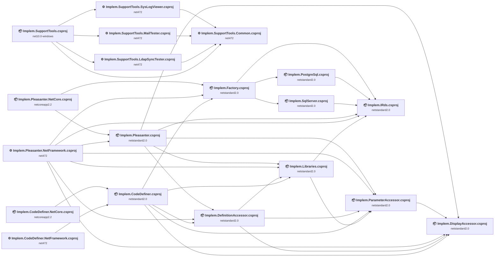

## Project Details

### Implem.CodeDefiner.NetCore\Implem.CodeDefiner.NetCore.csproj

#### Project Info

- **Current Target Framework:** netcoreapp2.2
- **Proposed Target Framework:** net10.0
- **SDK-style**: True
- **Project Kind:** DotNetCoreApp
- **Dependencies**: 1
- **Dependants**: 0
- **Number of Files**: 1
- **Number of Files with Incidents**: 1
- **Lines of Code**: 13
- **Estimated LOC to modify**: 0+ (at least 0.0% of the project)

#### Dependency Graph

Legend:
📦 SDK-style project
⚙️ Classic project

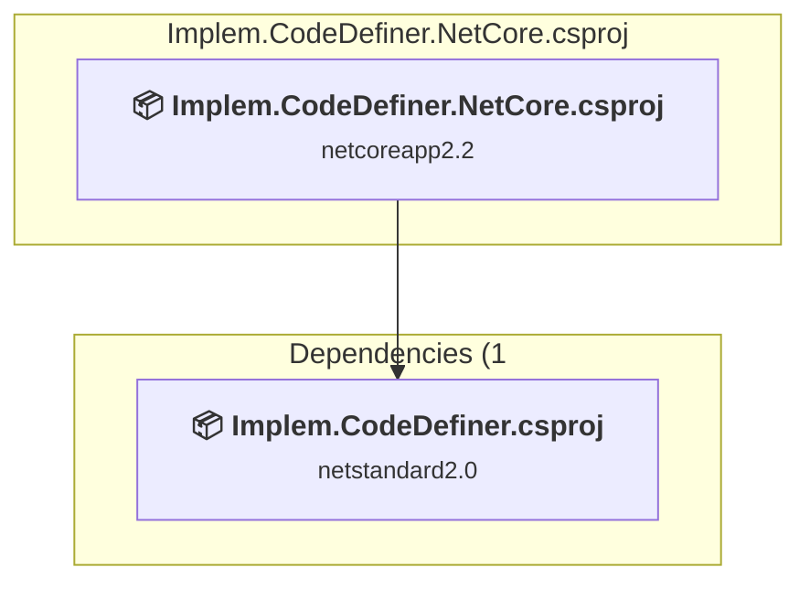

### API Compatibility

| Category | Count | Impact |
| :--- | :---: | :--- |
| 🔴 Binary Incompatible | 0 | High - Require code changes |
| 🟡 Source Incompatible | 0 | Medium - Needs re-compilation and potential conflicting API error fixing |
| 🔵 Behavioral change | 0 | Low - Behavioral changes that may require testing at runtime |
| ✅ Compatible | 8 |  |
| ***Total APIs Analyzed*** | ***8*** |  |

### Implem.CodeDefiner.NetFramework\Implem.CodeDefiner.NetFramework.csproj

#### Project Info

- **Current Target Framework:** net472
- **Proposed Target Framework:** net10.0
- **SDK-style**: False
- **Project Kind:** ClassicDotNetApp
- **Dependencies**: 1
- **Dependants**: 0
- **Number of Files**: 2
- **Number of Files with Incidents**: 1
- **Lines of Code**: 24
- **Estimated LOC to modify**: 0+ (at least 0.0% of the project)

#### Dependency Graph

Legend:
📦 SDK-style project
⚙️ Classic project

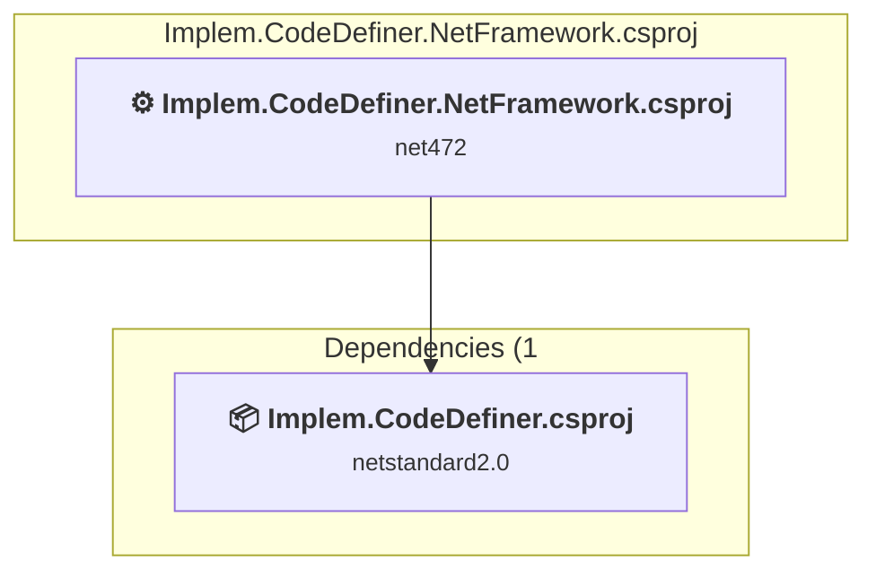

### API Compatibility

| Category | Count | Impact |
| :--- | :---: | :--- |
| 🔴 Binary Incompatible | 0 | High - Require code changes |
| 🟡 Source Incompatible | 0 | Medium - Needs re-compilation and potential conflicting API error fixing |
| 🔵 Behavioral change | 0 | Low - Behavioral changes that may require testing at runtime |
| ✅ Compatible | 2 |  |
| ***Total APIs Analyzed*** | ***2*** |  |

### Implem.CodeDefiner\Implem.CodeDefiner.csproj

#### Project Info

- **Current Target Framework:** netstandard2.0✅
- **SDK-style**: True
- **Project Kind:** ClassLibrary
- **Dependencies**: 5
- **Dependants**: 2
- **Number of Files**: 37
- **Number of Files with Incidents**: 3
- **Lines of Code**: 3783
- **Estimated LOC to modify**: 3+ (at least 0.1% of the project)

#### Dependency Graph

Legend:
📦 SDK-style project
⚙️ Classic project

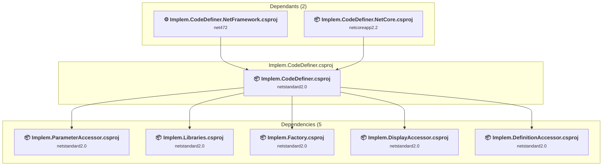

### API Compatibility

| Category | Count | Impact |
| :--- | :---: | :--- |
| 🔴 Binary Incompatible | 0 | High - Require code changes |
| 🟡 Source Incompatible | 3 | Medium - Needs re-compilation and potential conflicting API error fixing |
| 🔵 Behavioral change | 0 | Low - Behavioral changes that may require testing at runtime |
| ✅ Compatible | 3579 |  |
| ***Total APIs Analyzed*** | ***3582*** |  |

### Implem.DefinitionAccessor\Implem.DefinitionAccessor.csproj

#### Project Info

- **Current Target Framework:** netstandard2.0✅
- **SDK-style**: True
- **Project Kind:** ClassLibrary
- **Dependencies**: 3
- **Dependants**: 3
- **Number of Files**: 3
- **Lines of Code**: 14901
- **Estimated LOC to modify**: 0+ (at least 0.0% of the project)

#### Dependency Graph

Legend:
📦 SDK-style project
⚙️ Classic project

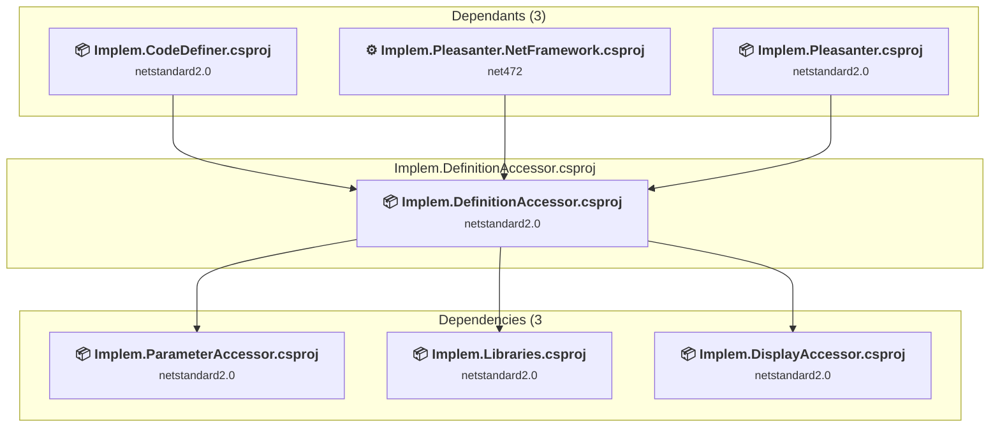

### API Compatibility

| Category | Count | Impact |
| :--- | :---: | :--- |
| 🔴 Binary Incompatible | 0 | High - Require code changes |
| 🟡 Source Incompatible | 0 | Medium - Needs re-compilation and potential conflicting API error fixing |
| 🔵 Behavioral change | 0 | Low - Behavioral changes that may require testing at runtime |
| ✅ Compatible | 38383 |  |
| ***Total APIs Analyzed*** | ***38383*** |  |

### Implem.DisplayAccessor\Implem.DisplayAccessor.csproj

#### Project Info

- **Current Target Framework:** netstandard2.0✅
- **SDK-style**: True
- **Project Kind:** ClassLibrary
- **Dependencies**: 0
- **Dependants**: 5
- **Number of Files**: 3
- **Lines of Code**: 46
- **Estimated LOC to modify**: 0+ (at least 0.0% of the project)

#### Dependency Graph

Legend:
📦 SDK-style project
⚙️ Classic project

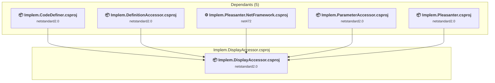

### API Compatibility

| Category | Count | Impact |
| :--- | :---: | :--- |
| 🔴 Binary Incompatible | 0 | High - Require code changes |
| 🟡 Source Incompatible | 0 | Medium - Needs re-compilation and potential conflicting API error fixing |
| 🔵 Behavioral change | 0 | Low - Behavioral changes that may require testing at runtime |
| ✅ Compatible | 14 |  |
| ***Total APIs Analyzed*** | ***14*** |  |

### Implem.Factory\Implem.Factory.csproj

#### Project Info

- **Current Target Framework:** netstandard2.0✅
- **SDK-style**: True
- **Project Kind:** ClassLibrary
- **Dependencies**: 3
- **Dependants**: 3
- **Number of Files**: 1
- **Lines of Code**: 22
- **Estimated LOC to modify**: 0+ (at least 0.0% of the project)

#### Dependency Graph

Legend:
📦 SDK-style project
⚙️ Classic project

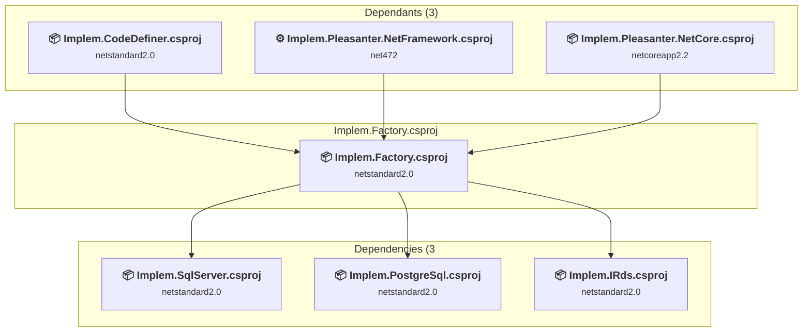

### API Compatibility

| Category | Count | Impact |
| :--- | :---: | :--- |
| 🔴 Binary Incompatible | 0 | High - Require code changes |
| 🟡 Source Incompatible | 0 | Medium - Needs re-compilation and potential conflicting API error fixing |
| 🔵 Behavioral change | 0 | Low - Behavioral changes that may require testing at runtime |
| ✅ Compatible | 9 |  |
| ***Total APIs Analyzed*** | ***9*** |  |

### Implem.Libraries\Implem.Libraries.csproj

#### Project Info

- **Current Target Framework:** netstandard2.0✅
- **SDK-style**: True
- **Project Kind:** ClassLibrary
- **Dependencies**: 2
- **Dependants**: 4
- **Number of Files**: 63
- **Number of Files with Incidents**: 3
- **Lines of Code**: 6217
- **Estimated LOC to modify**: 4+ (at least 0.1% of the project)

#### Dependency Graph

Legend:
📦 SDK-style project
⚙️ Classic project

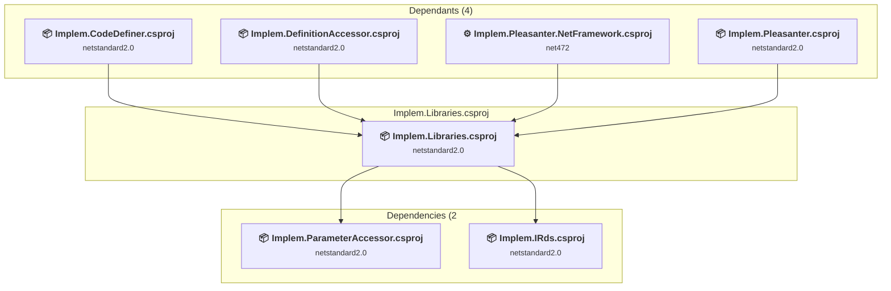

### API Compatibility

| Category | Count | Impact |
| :--- | :---: | :--- |
| 🔴 Binary Incompatible | 0 | High - Require code changes |
| 🟡 Source Incompatible | 4 | Medium - Needs re-compilation and potential conflicting API error fixing |
| 🔵 Behavioral change | 0 | Low - Behavioral changes that may require testing at runtime |
| ✅ Compatible | 4713 |  |
| ***Total APIs Analyzed*** | ***4717*** |  |

#### Project Technologies and Features

| Technology | Issues | Percentage | Migration Path |
| :--- | :---: | :---: | :--- |
| Legacy Cryptography | 1 | 25.0% | Obsolete or insecure cryptographic algorithms that have been deprecated for security reasons. These algorithms are no longer considered secure by modern standards. Migrate to modern cryptographic APIs using secure algorithms. |
| GDI+ / System.Drawing | 3 | 75.0% | System.Drawing APIs for 2D graphics, imaging, and printing that are available via NuGet package System.Drawing.Common. Note: Not recommended for server scenarios due to Windows dependencies; consider cross-platform alternatives like SkiaSharp or ImageSharp for new code. |

### Implem.ParameterAccessor\Implem.ParameterAccessor.csproj

#### Project Info

- **Current Target Framework:** netstandard2.0✅
- **SDK-style**: True
- **Project Kind:** ClassLibrary
- **Dependencies**: 1
- **Dependants**: 5
- **Number of Files**: 28
- **Lines of Code**: 483
- **Estimated LOC to modify**: 0+ (at least 0.0% of the project)

#### Dependency Graph

Legend:
📦 SDK-style project
⚙️ Classic project

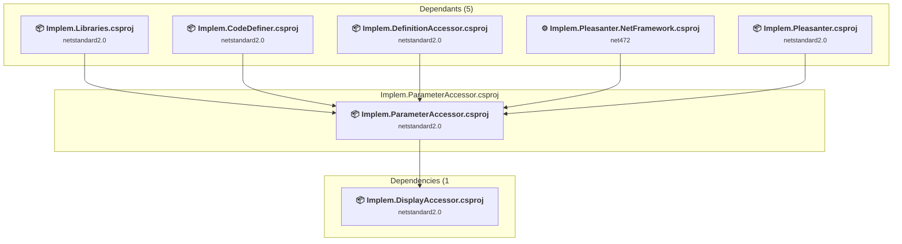

### API Compatibility

| Category | Count | Impact |
| :--- | :---: | :--- |
| 🔴 Binary Incompatible | 0 | High - Require code changes |
| 🟡 Source Incompatible | 0 | Medium - Needs re-compilation and potential conflicting API error fixing |
| 🔵 Behavioral change | 0 | Low - Behavioral changes that may require testing at runtime |
| ✅ Compatible | 278 |  |
| ***Total APIs Analyzed*** | ***278*** |  |

### Implem.Pleasanter.NetCore\Implem.Pleasanter.NetCore.csproj

#### Project Info

- **Current Target Framework:** netcoreapp2.2
- **Proposed Target Framework:** net10.0
- **SDK-style**: True
- **Project Kind:** AspNetCore
- **Dependencies**: 2
- **Dependants**: 0
- **Number of Files**: 956
- **Number of Files with Incidents**: 21
- **Lines of Code**: 4383
- **Estimated LOC to modify**: 64+ (at least 1.5% of the project)

#### Dependency Graph

Legend:
📦 SDK-style project
⚙️ Classic project

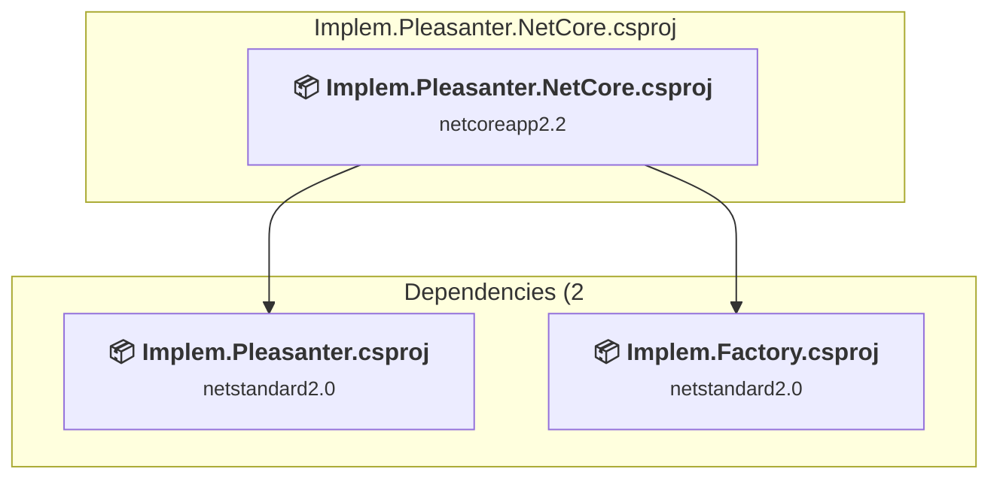

### API Compatibility

| Category | Count | Impact |
| :--- | :---: | :--- |
| 🔴 Binary Incompatible | 57 | High - Require code changes |
| 🟡 Source Incompatible | 4 | Medium - Needs re-compilation and potential conflicting API error fixing |
| 🔵 Behavioral change | 3 | Low - Behavioral changes that may require testing at runtime |
| ✅ Compatible | 3573 |  |
| ***Total APIs Analyzed*** | ***3637*** |  |

#### Project Technologies and Features

| Technology | Issues | Percentage | Migration Path |
| :--- | :---: | :---: | :--- |
| ASP.NET Framework (System.Web) | 57 | 89.1% | Legacy ASP.NET Framework APIs for web applications (System.Web.*) that don't exist in ASP.NET Core due to architectural differences. ASP.NET Core represents a complete redesign of the web framework. Migrate to ASP.NET Core equivalents or consider System.Web.Adapters package for compatibility. |

### Implem.Pleasanter.NetFramework\Implem.Pleasanter.NetFramework.csproj

#### Project Info

- **Current Target Framework:** net472
- **Proposed Target Framework:** net10.0
- **SDK-style**: False
- **Project Kind:** Wap
- **Dependencies**: 7
- **Dependants**: 0
- **Number of Files**: 1010
- **Number of Files with Incidents**: 37
- **Lines of Code**: 4051
- **Estimated LOC to modify**: 1376+ (at least 34.0% of the project)

#### Dependency Graph

Legend:
📦 SDK-style project
⚙️ Classic project

```mermaid
flowchart TB
    subgraph current["Implem.Pleasanter.NetFramework.csproj"]
        MAIN["<b>⚙️&nbsp;Implem.Pleasanter.NetFramework.csproj</b><br/><small>net472</small>"]
        click MAIN "#implempleasanternetframeworkimplempleasanternetframeworkcsproj"
    end
    subgraph downstream["Dependencies (7"]
        P3["<b>📦&nbsp;Implem.DefinitionAccessor.csproj</b><br/><small>netstandard2.0</small>"]
        P6["<b>📦&nbsp;Implem.DisplayAccessor.csproj</b><br/><small>netstandard2.0</small>"]
        P19["<b>📦&nbsp;Implem.Factory.csproj</b><br/><small>netstandard2.0</small>"]
        P1["<b>📦&nbsp;Implem.Libraries.csproj</b><br/><small>netstandard2.0</small>"]
        P5["<b>📦&nbsp;Implem.ParameterAccessor.csproj</b><br/><small>netstandard2.0</small>"]
        P9["<b>📦&nbsp;Implem.Pleasanter.csproj</b><br/><small>netstandard2.0</small>"]
        P16["<b>📦&nbsp;Implem.IRds.csproj</b><br/><small>netstandard2.0</small>"]
        click P3 "#implemdefinitionaccessorimplemdefinitionaccessorcsproj"
        click P6 "#implemdisplayaccessorimplemdisplayaccessorcsproj"
        click P19 "#implemfactoryimplemfactorycsproj"
        click P1 "#implemlibrariesimplemlibrariescsproj"
        click P5 "#implemparameteraccessorimplemparameteraccessorcsproj"
        click P9 "#implempleasanterimplempleasantercsproj"
        click P16 "#rdsimplemirdsimplemirdscsproj"
    end
    MAIN --> P3
    MAIN --> P6
    MAIN --> P19
    MAIN --> P1
    MAIN --> P5
    MAIN --> P9
    MAIN --> P16

```

### API Compatibility

| Category | Count | Impact |
| :--- | :---: | :--- |
| 🔴 Binary Incompatible | 1180 | High - Require code changes |
| 🟡 Source Incompatible | 172 | Medium - Needs re-compilation and potential conflicting API error fixing |
| 🔵 Behavioral change | 24 | Low - Behavioral changes that may require testing at runtime |
| ✅ Compatible | 1524 |  |
| ***Total APIs Analyzed*** | ***2900*** |  |

#### Project Technologies and Features

| Technology | Issues | Percentage | Migration Path |
| :--- | :---: | :---: | :--- |
| Legacy Configuration System | 2 | 0.1% | Legacy XML-based configuration system (app.config/web.config) that has been replaced by a more flexible configuration model in .NET Core. The old system was rigid and XML-based. Migrate to Microsoft.Extensions.Configuration with JSON/environment variables; use System.Configuration.ConfigurationManager NuGet package as interim bridge if needed. |
| IdentityModel & Claims-based Security | 4 | 0.3% | Windows Identity Foundation (WIF), SAML, and claims-based authentication APIs that have been replaced by modern identity libraries. WIF was the original identity framework for .NET Framework. Migrate to Microsoft.IdentityModel.* packages (modern identity stack). |
| ASP.NET Framework (System.Web) | 1344 | 97.7% | Legacy ASP.NET Framework APIs for web applications (System.Web.*) that don't exist in ASP.NET Core due to architectural differences. ASP.NET Core represents a complete redesign of the web framework. Migrate to ASP.NET Core equivalents or consider System.Web.Adapters package for compatibility. |

### Implem.Pleasanter\Implem.Pleasanter.csproj

#### Project Info

- **Current Target Framework:** netstandard2.0✅
- **SDK-style**: True
- **Project Kind:** ClassLibrary
- **Dependencies**: 5
- **Dependants**: 2
- **Number of Files**: 382
- **Number of Files with Incidents**: 41
- **Lines of Code**: 246156
- **Estimated LOC to modify**: 444+ (at least 0.2% of the project)

#### Dependency Graph

Legend:
📦 SDK-style project
⚙️ Classic project

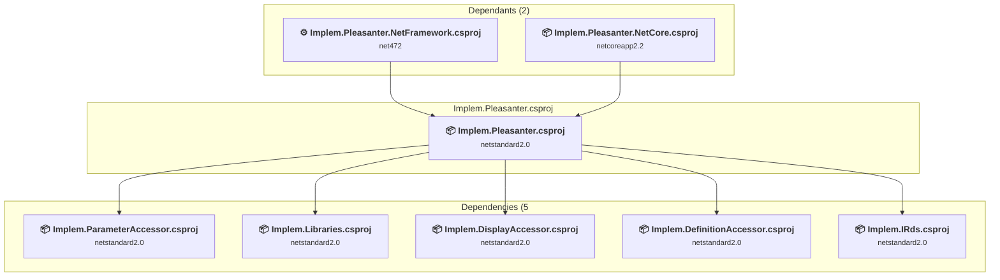

### API Compatibility

| Category | Count | Impact |
| :--- | :---: | :--- |
| 🔴 Binary Incompatible | 346 | High - Require code changes |
| 🟡 Source Incompatible | 94 | Medium - Needs re-compilation and potential conflicting API error fixing |
| 🔵 Behavioral change | 4 | Low - Behavioral changes that may require testing at runtime |
| ✅ Compatible | 112899 |  |
| ***Total APIs Analyzed*** | ***113343*** |  |

#### Project Technologies and Features

| Technology | Issues | Percentage | Migration Path |
| :--- | :---: | :---: | :--- |
| GDI+ / System.Drawing | 58 | 13.1% | System.Drawing APIs for 2D graphics, imaging, and printing that are available via NuGet package System.Drawing.Common. Note: Not recommended for server scenarios due to Windows dependencies; consider cross-platform alternatives like SkiaSharp or ImageSharp for new code. |
| ASP.NET Framework (System.Web) | 346 | 77.9% | Legacy ASP.NET Framework APIs for web applications (System.Web.*) that don't exist in ASP.NET Core due to architectural differences. ASP.NET Core represents a complete redesign of the web framework. Migrate to ASP.NET Core equivalents or consider System.Web.Adapters package for compatibility. |
| Directory Services (LDAP/Active Directory) | 29 | 6.5% | APIs for interacting with directory services like Active Directory and LDAP that are available via NuGet packages. The core functionality has been moved to separate packages. Install System.DirectoryServices (AD/LDAP), System.DirectoryServices.AccountManagement (user/group management), System.DirectoryServices.Protocols (LDAP protocol). |
| Legacy Configuration System | 2 | 0.5% | Legacy XML-based configuration system (app.config/web.config) that has been replaced by a more flexible configuration model in .NET Core. The old system was rigid and XML-based. Migrate to Microsoft.Extensions.Configuration with JSON/environment variables; use System.Configuration.ConfigurationManager NuGet package as interim bridge if needed. |

### Implem.SupportTools\Common\Implem.SupportTools.Common.csproj

#### Project Info

- **Current Target Framework:** net472
- **Proposed Target Framework:** net10.0
- **SDK-style**: False
- **Project Kind:** ClassicClassLibrary
- **Dependencies**: 0
- **Dependants**: 4
- **Number of Files**: 4
- **Number of Files with Incidents**: 1
- **Lines of Code**: 117
- **Estimated LOC to modify**: 0+ (at least 0.0% of the project)

#### Dependency Graph

Legend:
📦 SDK-style project
⚙️ Classic project

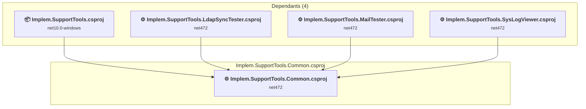

### API Compatibility

| Category | Count | Impact |
| :--- | :---: | :--- |
| 🔴 Binary Incompatible | 0 | High - Require code changes |
| 🟡 Source Incompatible | 0 | Medium - Needs re-compilation and potential conflicting API error fixing |
| 🔵 Behavioral change | 0 | Low - Behavioral changes that may require testing at runtime |
| ✅ Compatible | 90 |  |
| ***Total APIs Analyzed*** | ***90*** |  |

### Implem.SupportTools\Launcher\Implem.SupportTools.csproj

#### Project Info

- **Current Target Framework:** net10.0-windows✅
- **SDK-style**: True
- **Project Kind:** Wpf
- **Dependencies**: 4
- **Dependants**: 0
- **Number of Files**: 10
- **Lines of Code**: 402
- **Estimated LOC to modify**: 0+ (at least 0.0% of the project)

#### Dependency Graph

Legend:
📦 SDK-style project
⚙️ Classic project

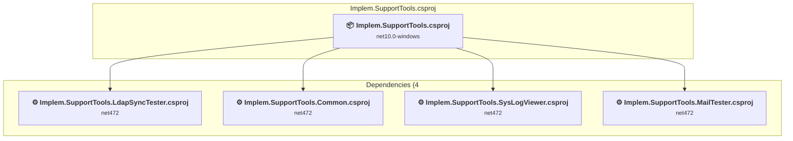

### API Compatibility

| Category | Count | Impact |
| :--- | :---: | :--- |
| 🔴 Binary Incompatible | 0 | High - Require code changes |
| 🟡 Source Incompatible | 0 | Medium - Needs re-compilation and potential conflicting API error fixing |
| 🔵 Behavioral change | 0 | Low - Behavioral changes that may require testing at runtime |
| ✅ Compatible | 0 |  |
| ***Total APIs Analyzed*** | ***0*** |  |

### Implem.SupportTools\LdapSyncTester\Implem.SupportTools.LdapSyncTester.csproj

#### Project Info

- **Current Target Framework:** net472
- **Proposed Target Framework:** net10.0-windows
- **SDK-style**: False
- **Project Kind:** ClassicWpf
- **Dependencies**: 1
- **Dependants**: 1
- **Number of Files**: 7
- **Number of Files with Incidents**: 5
- **Lines of Code**: 516
- **Estimated LOC to modify**: 79+ (at least 15.3% of the project)

#### Dependency Graph

Legend:
📦 SDK-style project
⚙️ Classic project

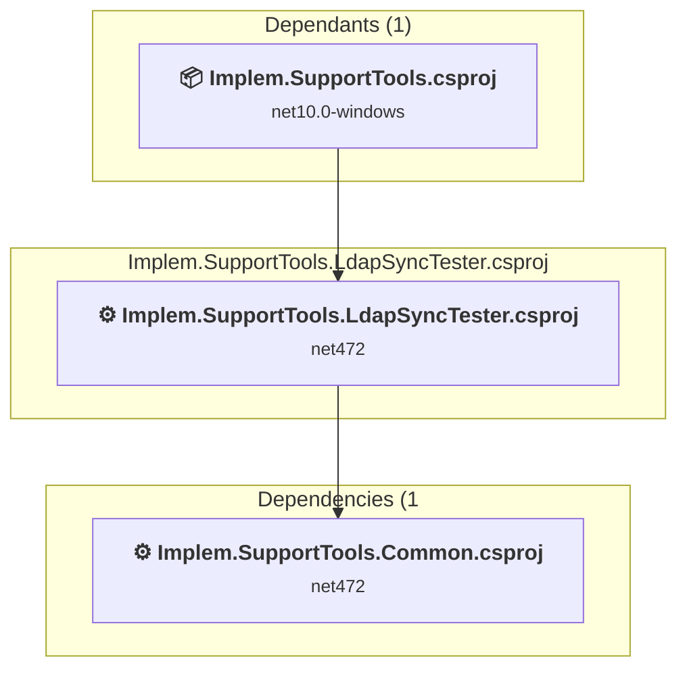

### API Compatibility

| Category | Count | Impact |
| :--- | :---: | :--- |
| 🔴 Binary Incompatible | 30 | High - Require code changes |
| 🟡 Source Incompatible | 47 | Medium - Needs re-compilation and potential conflicting API error fixing |
| 🔵 Behavioral change | 2 | Low - Behavioral changes that may require testing at runtime |
| ✅ Compatible | 365 |  |
| ***Total APIs Analyzed*** | ***444*** |  |

#### Project Technologies and Features

| Technology | Issues | Percentage | Migration Path |
| :--- | :---: | :---: | :--- |
| Legacy Configuration System | 2 | 2.5% | Legacy XML-based configuration system (app.config/web.config) that has been replaced by a more flexible configuration model in .NET Core. The old system was rigid and XML-based. Migrate to Microsoft.Extensions.Configuration with JSON/environment variables; use System.Configuration.ConfigurationManager NuGet package as interim bridge if needed. |
| WPF (Windows Presentation Foundation) | 9 | 11.4% | WPF APIs for building Windows desktop applications with XAML-based UI that are available in .NET on Windows. WPF provides rich desktop UI capabilities with data binding and styling. Enable Windows Desktop support: Option 1 (Recommended): Target net9.0-windows; Option 2: Add <UseWindowsDesktop>true</UseWindowsDesktop>. |
| Directory Services (LDAP/Active Directory) | 45 | 57.0% | APIs for interacting with directory services like Active Directory and LDAP that are available via NuGet packages. The core functionality has been moved to separate packages. Install System.DirectoryServices (AD/LDAP), System.DirectoryServices.AccountManagement (user/group management), System.DirectoryServices.Protocols (LDAP protocol). |

### Implem.SupportTools\MailTester\Implem.SupportTools.MailTester.csproj

#### Project Info

- **Current Target Framework:** net472
- **Proposed Target Framework:** net10.0-windows
- **SDK-style**: False
- **Project Kind:** ClassicWpf
- **Dependencies**: 1
- **Dependants**: 1
- **Number of Files**: 11
- **Number of Files with Incidents**: 4
- **Lines of Code**: 618
- **Estimated LOC to modify**: 32+ (at least 5.2% of the project)

#### Dependency Graph

Legend:
📦 SDK-style project
⚙️ Classic project

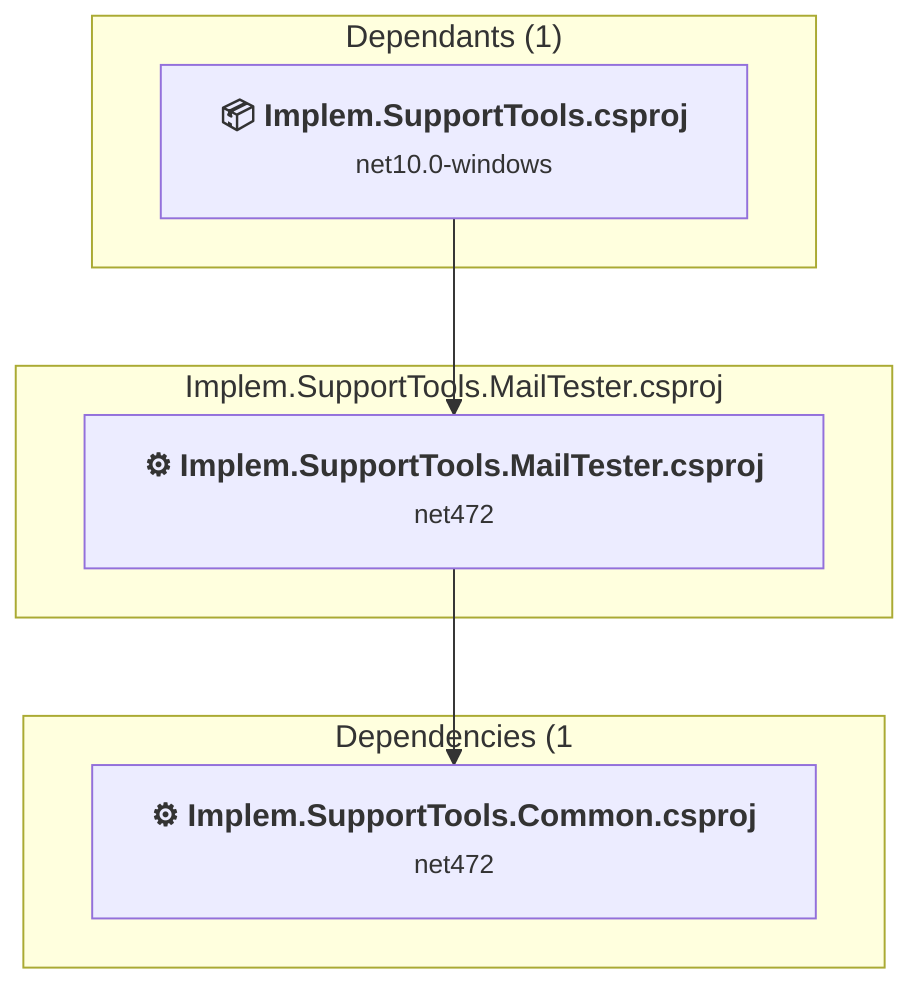

### API Compatibility

| Category | Count | Impact |
| :--- | :---: | :--- |
| 🔴 Binary Incompatible | 28 | High - Require code changes |
| 🟡 Source Incompatible | 2 | Medium - Needs re-compilation and potential conflicting API error fixing |
| 🔵 Behavioral change | 2 | Low - Behavioral changes that may require testing at runtime |
| ✅ Compatible | 795 |  |
| ***Total APIs Analyzed*** | ***827*** |  |

#### Project Technologies and Features

| Technology | Issues | Percentage | Migration Path |
| :--- | :---: | :---: | :--- |
| Legacy Configuration System | 2 | 6.3% | Legacy XML-based configuration system (app.config/web.config) that has been replaced by a more flexible configuration model in .NET Core. The old system was rigid and XML-based. Migrate to Microsoft.Extensions.Configuration with JSON/environment variables; use System.Configuration.ConfigurationManager NuGet package as interim bridge if needed. |
| WPF (Windows Presentation Foundation) | 16 | 50.0% | WPF APIs for building Windows desktop applications with XAML-based UI that are available in .NET on Windows. WPF provides rich desktop UI capabilities with data binding and styling. Enable Windows Desktop support: Option 1 (Recommended): Target net9.0-windows; Option 2: Add <UseWindowsDesktop>true</UseWindowsDesktop>. |

### Implem.SupportTools\SysLogViewer\Implem.SupportTools.SysLogViewer.csproj

#### Project Info

- **Current Target Framework:** net472
- **Proposed Target Framework:** net10.0-windows
- **SDK-style**: False
- **Project Kind:** ClassicWpf
- **Dependencies**: 1
- **Dependants**: 1
- **Number of Files**: 12
- **Number of Files with Incidents**: 10
- **Lines of Code**: 699
- **Estimated LOC to modify**: 156+ (at least 22.3% of the project)

#### Dependency Graph

Legend:
📦 SDK-style project
⚙️ Classic project

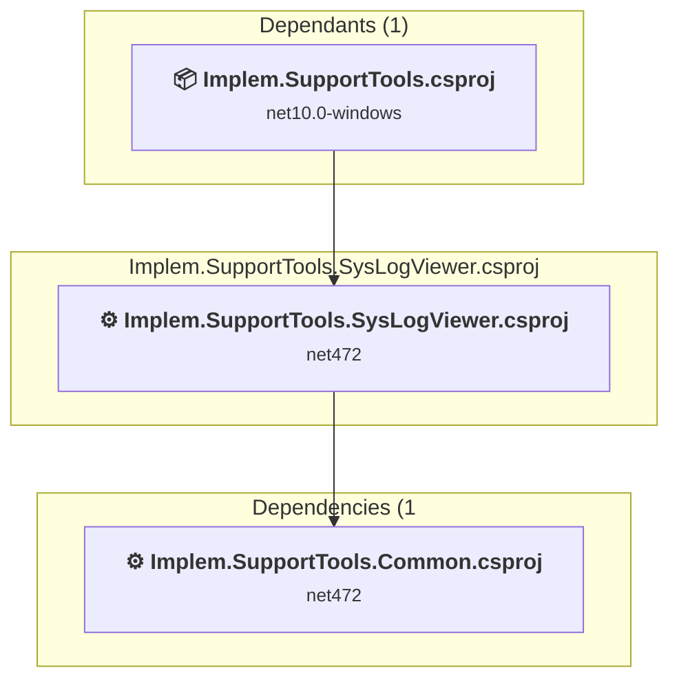

### API Compatibility

| Category | Count | Impact |
| :--- | :---: | :--- |
| 🔴 Binary Incompatible | 119 | High - Require code changes |
| 🟡 Source Incompatible | 33 | Medium - Needs re-compilation and potential conflicting API error fixing |
| 🔵 Behavioral change | 4 | Low - Behavioral changes that may require testing at runtime |
| ✅ Compatible | 805 |  |
| ***Total APIs Analyzed*** | ***961*** |  |

#### Project Technologies and Features

| Technology | Issues | Percentage | Migration Path |
| :--- | :---: | :---: | :--- |
| Legacy Configuration System | 2 | 1.3% | Legacy XML-based configuration system (app.config/web.config) that has been replaced by a more flexible configuration model in .NET Core. The old system was rigid and XML-based. Migrate to Microsoft.Extensions.Configuration with JSON/environment variables; use System.Configuration.ConfigurationManager NuGet package as interim bridge if needed. |
| WPF (Windows Presentation Foundation) | 62 | 39.7% | WPF APIs for building Windows desktop applications with XAML-based UI that are available in .NET on Windows. WPF provides rich desktop UI capabilities with data binding and styling. Enable Windows Desktop support: Option 1 (Recommended): Target net9.0-windows; Option 2: Add <UseWindowsDesktop>true</UseWindowsDesktop>. |

### Rds\Implem.IRds\Implem.IRds.csproj

#### Project Info

- **Current Target Framework:** netstandard2.0✅
- **SDK-style**: True
- **Project Kind:** ClassLibrary
- **Dependencies**: 0
- **Dependants**: 6
- **Number of Files**: 12
- **Lines of Code**: 191
- **Estimated LOC to modify**: 0+ (at least 0.0% of the project)

#### Dependency Graph

Legend:
📦 SDK-style project
⚙️ Classic project

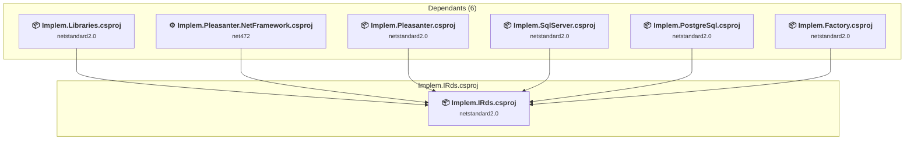

### API Compatibility

| Category | Count | Impact |
| :--- | :---: | :--- |
| 🔴 Binary Incompatible | 0 | High - Require code changes |
| 🟡 Source Incompatible | 0 | Medium - Needs re-compilation and potential conflicting API error fixing |
| 🔵 Behavioral change | 0 | Low - Behavioral changes that may require testing at runtime |
| ✅ Compatible | 118 |  |
| ***Total APIs Analyzed*** | ***118*** |  |

### Rds\Implem.PostgreSql\Implem.PostgreSql.csproj

#### Project Info

- **Current Target Framework:** netstandard2.0✅
- **SDK-style**: True
- **Project Kind:** ClassLibrary
- **Dependencies**: 1
- **Dependants**: 1
- **Number of Files**: 12
- **Number of Files with Incidents**: 1
- **Lines of Code**: 932
- **Estimated LOC to modify**: 0+ (at least 0.0% of the project)

#### Dependency Graph

Legend:
📦 SDK-style project
⚙️ Classic project

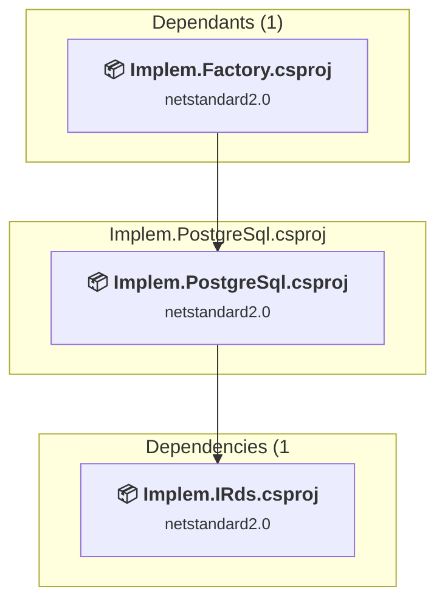

### API Compatibility

| Category | Count | Impact |
| :--- | :---: | :--- |
| 🔴 Binary Incompatible | 0 | High - Require code changes |
| 🟡 Source Incompatible | 0 | Medium - Needs re-compilation and potential conflicting API error fixing |
| 🔵 Behavioral change | 0 | Low - Behavioral changes that may require testing at runtime |
| ✅ Compatible | 714 |  |
| ***Total APIs Analyzed*** | ***714*** |  |

### Rds\Implem.SqlServer\Implem.SqlServer.csproj

#### Project Info

- **Current Target Framework:** netstandard2.0✅
- **SDK-style**: True
- **Project Kind:** ClassLibrary
- **Dependencies**: 1
- **Dependants**: 1
- **Number of Files**: 12
- **Number of Files with Incidents**: 7
- **Lines of Code**: 884
- **Estimated LOC to modify**: 232+ (at least 26.2% of the project)

#### Dependency Graph

Legend:
📦 SDK-style project
⚙️ Classic project

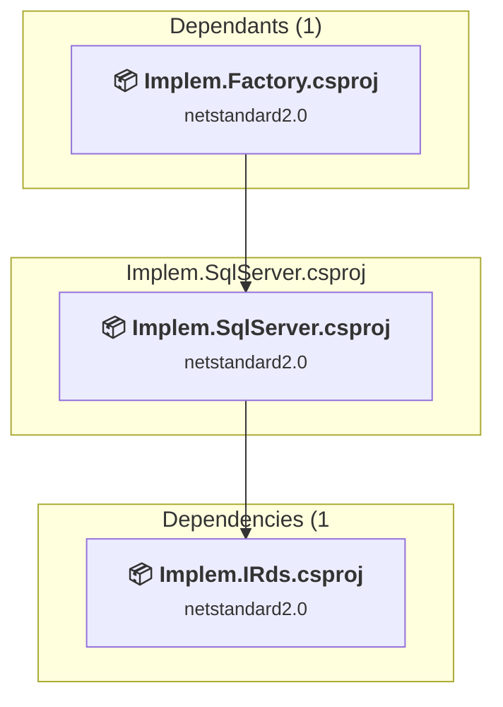

### API Compatibility

| Category | Count | Impact |
| :--- | :---: | :--- |
| 🔴 Binary Incompatible | 0 | High - Require code changes |
| 🟡 Source Incompatible | 232 | Medium - Needs re-compilation and potential conflicting API error fixing |
| 🔵 Behavioral change | 0 | Low - Behavioral changes that may require testing at runtime |
| ✅ Compatible | 419 |  |
| ***Total APIs Analyzed*** | ***651*** |  |

