# Projects and dependencies analysis

This document provides a comprehensive overview of the projects and their dependencies in the context of upgrading to .NETCoreApp,Version=v10.0.

## Table of Contents

- [Executive Summary](#executive-Summary)
  - [Highlevel Metrics](#highlevel-metrics)
  - [Projects Compatibility](#projects-compatibility)
  - [Package Compatibility](#package-compatibility)
  - [API Compatibility](#api-compatibility)
- [Aggregate NuGet packages details](#aggregate-nuget-packages-details)
- [Top API Migration Challenges](#top-api-migration-challenges)
  - [Technologies and Features](#technologies-and-features)
  - [Most Frequent API Issues](#most-frequent-api-issues)
- [Projects Relationship Graph](#projects-relationship-graph)
- [Project Details](#project-details)

  - [docker-compose.dcproj](#docker-composedcproj)
  - [Implem.CodeDefiner\Implem.CodeDefiner.csproj](#implemcodedefinerimplemcodedefinercsproj)
  - [Implem.DefinitionAccessor\Implem.DefinitionAccessor.csproj](#implemdefinitionaccessorimplemdefinitionaccessorcsproj)
  - [Implem.DisplayAccessor\Implem.DisplayAccessor.csproj](#implemdisplayaccessorimplemdisplayaccessorcsproj)
  - [Implem.Factory\Implem.Factory.csproj](#implemfactoryimplemfactorycsproj)
  - [Implem.Libraries\Implem.Libraries.csproj](#implemlibrariesimplemlibrariescsproj)
  - [Implem.ParameterAccessor\Implem.ParameterAccessor.csproj](#implemparameteraccessorimplemparameteraccessorcsproj)
  - [Implem.Pleasanter\Implem.Pleasanter.csproj](#implempleasanterimplempleasantercsproj)
  - [Implem.Plugins\Implem.Plugins.csproj](#implempluginsimplempluginscsproj)
  - [Implem.TestAutomation\Implem.TestAutomation.csproj](#implemtestautomationimplemtestautomationcsproj)
  - [Rds\Implem.IRds\Implem.IRds.csproj](#rdsimplemirdsimplemirdscsproj)
  - [Rds\Implem.MySql\Implem.MySql.csproj](#rdsimplemmysqlimplemmysqlcsproj)
  - [Rds\Implem.PostgreSql\Implem.PostgreSql.csproj](#rdsimplempostgresqlimplempostgresqlcsproj)
  - [Rds\Implem.SqlServer\Implem.SqlServer.csproj](#rdsimplemsqlserverimplemsqlservercsproj)

## Executive Summary

### Highlevel Metrics

| Metric | Count | Status |
| :--- | :---: | :--- |
| Total Projects | 14 | 13 require upgrade |
| Total NuGet Packages | 50 | 9 need upgrade |
| Total Code Files | 883 |  |
| Total Code Files with Incidents | 36 |  |
| Total Lines of Code | 444305 |  |
| Total Number of Issues | 464 |  |
| Estimated LOC to modify | 424+ | at least 0.1% of codebase |

### Projects Compatibility

| Project | Target Framework | Difficulty | Package Issues | API Issues | Est. LOC Impact | Description |
| :--- | :---: | :---: | :---: | :---: | :---: | :--- |
| [docker-compose.dcproj](#docker-composedcproj) |  | ✅ None | 0 | 0 |  | DotNetCoreApp, Sdk Style = True |
| [Implem.CodeDefiner\Implem.CodeDefiner.csproj](#implemcodedefinerimplemcodedefinercsproj) | net8.0 | 🟢 Low | 1 | 19 | 19+ | DotNetCoreApp, Sdk Style = True |
| [Implem.DefinitionAccessor\Implem.DefinitionAccessor.csproj](#implemdefinitionaccessorimplemdefinitionaccessorcsproj) | net8.0 | 🟢 Low | 0 | 1 | 1+ | ClassLibrary, Sdk Style = True |
| [Implem.DisplayAccessor\Implem.DisplayAccessor.csproj](#implemdisplayaccessorimplemdisplayaccessorcsproj) | net8.0 | 🟢 Low | 0 | 0 |  | ClassLibrary, Sdk Style = True |
| [Implem.Factory\Implem.Factory.csproj](#implemfactoryimplemfactorycsproj) | net8.0 | 🟢 Low | 0 | 0 |  | ClassLibrary, Sdk Style = True |
| [Implem.Libraries\Implem.Libraries.csproj](#implemlibrariesimplemlibrariescsproj) | net8.0 | 🟢 Low | 4 | 0 |  | ClassLibrary, Sdk Style = True |
| [Implem.ParameterAccessor\Implem.ParameterAccessor.csproj](#implemparameteraccessorimplemparameteraccessorcsproj) | net8.0 | 🟢 Low | 0 | 0 |  | ClassLibrary, Sdk Style = True |
| [Implem.Pleasanter\Implem.Pleasanter.csproj](#implempleasanterimplempleasantercsproj) | net8.0 | 🟢 Low | 14 | 169 | 169+ | AspNetCore, Sdk Style = True |
| [Implem.Plugins\Implem.Plugins.csproj](#implempluginsimplempluginscsproj) | net8.0 | 🟢 Low | 0 | 0 |  | ClassLibrary, Sdk Style = True |
| [Implem.TestAutomation\Implem.TestAutomation.csproj](#implemtestautomationimplemtestautomationcsproj) | net8.0 | 🟢 Low | 8 | 3 | 3+ | DotNetCoreApp, Sdk Style = True |
| [Rds\Implem.IRds\Implem.IRds.csproj](#rdsimplemirdsimplemirdscsproj) | net8.0 | 🟢 Low | 0 | 0 |  | ClassLibrary, Sdk Style = True |
| [Rds\Implem.MySql\Implem.MySql.csproj](#rdsimplemmysqlimplemmysqlcsproj) | net8.0 | 🟢 Low | 0 | 0 |  | ClassLibrary, Sdk Style = True |
| [Rds\Implem.PostgreSql\Implem.PostgreSql.csproj](#rdsimplempostgresqlimplempostgresqlcsproj) | net8.0 | 🟢 Low | 0 | 0 |  | ClassLibrary, Sdk Style = True |
| [Rds\Implem.SqlServer\Implem.SqlServer.csproj](#rdsimplemsqlserverimplemsqlservercsproj) | net8.0 | 🟢 Low | 0 | 232 | 232+ | ClassLibrary, Sdk Style = True |

### Package Compatibility

| Status | Count | Percentage |
| :--- | :---: | :---: |
| ✅ Compatible | 41 | 82.0% |
| ⚠️ Incompatible | 2 | 4.0% |
| 🔄 Upgrade Recommended | 7 | 14.0% |
| ***Total NuGet Packages*** | ***50*** | ***100%*** |

### API Compatibility

| Category | Count | Impact |
| :--- | :---: | :--- |
| 🔴 Binary Incompatible | 1 | High - Require code changes |
| 🟡 Source Incompatible | 383 | Medium - Needs re-compilation and potential conflicting API error fixing |
| 🔵 Behavioral change | 40 | Low - Behavioral changes that may require testing at runtime |
| ✅ Compatible | 254570 |  |
| ***Total APIs Analyzed*** | ***254994*** |  |

## Aggregate NuGet packages details

| Package | Current Version | Suggested Version | Projects | Description |
| :--- | :---: | :---: | :--- | :--- |
| AspNetCore.HealthChecks.MySql | 8.0.1 |  | [Implem.Pleasanter.csproj](#implempleasanterimplempleasantercsproj) | ✅Compatible |
| AspNetCore.HealthChecks.NpgSql | 8.0.2 |  | [Implem.Pleasanter.csproj](#implempleasanterimplempleasantercsproj) | ✅Compatible |
| AspNetCore.HealthChecks.SqlServer | 8.0.2 |  | [Implem.Pleasanter.csproj](#implempleasanterimplempleasantercsproj) | ✅Compatible |
| AspNetCore.HealthChecks.UI.Client | 8.0.1 |  | [Implem.Pleasanter.csproj](#implempleasanterimplempleasantercsproj) | ✅Compatible |
| AspNetCoreCurrentRequestContext | 2.0.0 |  | [Implem.Pleasanter.csproj](#implempleasanterimplempleasantercsproj) [Implem.TestAutomation.csproj](#implemtestautomationimplemtestautomationcsproj) | ✅Compatible |
| Azure.Extensions.AspNetCore.DataProtection.Blobs | 1.5.0 |  | [Implem.Pleasanter.csproj](#implempleasanterimplempleasantercsproj) | ✅Compatible |
| Azure.Extensions.AspNetCore.DataProtection.Keys | 1.4.0 |  | [Implem.Pleasanter.csproj](#implempleasanterimplempleasantercsproj) | ✅Compatible |
| Azure.Identity | 1.13.2 |  | [Implem.Pleasanter.csproj](#implempleasanterimplempleasantercsproj) | ⚠️NuGet パッケージは非推奨です |
| BuildBundlerMinifier | 3.2.449 |  | [Implem.Pleasanter.csproj](#implempleasanterimplempleasantercsproj) | ✅Compatible |
| CsvHelper | 33.0.1 |  | [Implem.Libraries.csproj](#implemlibrariesimplemlibrariescsproj) [Implem.TestAutomation.csproj](#implemtestautomationimplemtestautomationcsproj) | ✅Compatible |
| DiffMatchPatch | 3.0.0 |  | [Implem.Pleasanter.csproj](#implempleasanterimplempleasantercsproj) | ✅Compatible |
| Fare | 2.2.1 |  | [Implem.Pleasanter.csproj](#implempleasanterimplempleasantercsproj) | ✅Compatible |
| JsonDiffPatch.Net | 2.3.0 |  | [Implem.CodeDefiner.csproj](#implemcodedefinerimplemcodedefinercsproj) | ✅Compatible |
| MailKit | 4.11.0 |  | [Implem.Pleasanter.csproj](#implempleasanterimplempleasantercsproj) | ✅Compatible |
| Microsoft.AspNet.Mvc | 5.3.0 |  | [Implem.Pleasanter.csproj](#implempleasanterimplempleasantercsproj) | NuGet パッケージの機能は、フレームワークの参照に含まれています |
| Microsoft.AspNet.Razor | 3.3.0 |  | [Implem.Pleasanter.csproj](#implempleasanterimplempleasantercsproj) | NuGet パッケージの機能は、フレームワークの参照に含まれています |
| Microsoft.AspNet.WebPages | 3.3.0 |  | [Implem.Pleasanter.csproj](#implempleasanterimplempleasantercsproj) | NuGet パッケージの機能は、フレームワークの参照に含まれています |
| Microsoft.ClearScript.Complete | 7.5.0 |  | [Implem.Pleasanter.csproj](#implempleasanterimplempleasantercsproj) | ✅Compatible |
| Microsoft.Extensions.Diagnostics.HealthChecks | 8.0.8 | 10.0.1 | [Implem.Pleasanter.csproj](#implempleasanterimplempleasantercsproj) | NuGet パッケージのアップグレードをおすすめします |
| Microsoft.VisualStudio.Azure.Containers.Tools.Targets | 1.21.2 |  | [Implem.CodeDefiner.csproj](#implemcodedefinerimplemcodedefinercsproj) [Implem.Pleasanter.csproj](#implempleasanterimplempleasantercsproj) [Implem.TestAutomation.csproj](#implemtestautomationimplemtestautomationcsproj) | ⚠️NuGet パッケージに互換性がありません |
| Microsoft.Web.Infrastructure | 2.0.0 |  | [Implem.Pleasanter.csproj](#implempleasanterimplempleasantercsproj) | NuGet パッケージの機能は、フレームワークの参照に含まれています |
| MimeKit | 4.11.0 |  | [Implem.Pleasanter.csproj](#implempleasanterimplempleasantercsproj) | ✅Compatible |
| MySqlConnector | 2.4.0 |  | [Implem.MySql.csproj](#rdsimplemmysqlimplemmysqlcsproj) | ✅Compatible |
| Newtonsoft.Json | 13.0.3 | 13.0.4 | [Implem.Libraries.csproj](#implemlibrariesimplemlibrariescsproj) [Implem.Pleasanter.csproj](#implempleasanterimplempleasantercsproj) [Implem.TestAutomation.csproj](#implemtestautomationimplemtestautomationcsproj) | NuGet パッケージのアップグレードをおすすめします |
| NLog.Web.AspNetCore | 5.4.0 |  | [Implem.Pleasanter.csproj](#implempleasanterimplempleasantercsproj) | ✅Compatible |
| Novell.Directory.Ldap.NETStandard | 3.6.0 |  | [Implem.Pleasanter.csproj](#implempleasanterimplempleasantercsproj) | ✅Compatible |
| Npgsql | 8.0.7 |  | [Implem.CodeDefiner.csproj](#implemcodedefinerimplemcodedefinercsproj) [Implem.Factory.csproj](#implemfactoryimplemfactorycsproj) [Implem.Pleasanter.csproj](#implempleasanterimplempleasantercsproj) [Implem.PostgreSql.csproj](#rdsimplempostgresqlimplempostgresqlcsproj) | ✅Compatible |
| Otp.NET | 1.4.0 |  | [Implem.Pleasanter.csproj](#implempleasanterimplempleasantercsproj) | ✅Compatible |
| Quartz.AspNetCore | 3.14.0 |  | [Implem.Pleasanter.csproj](#implempleasanterimplempleasantercsproj) | ✅Compatible |
| Selenium.Support | 4.29.0 |  | [Implem.TestAutomation.csproj](#implemtestautomationimplemtestautomationcsproj) | ✅Compatible |
| Selenium.WebDriver | 4.29.0 |  | [Implem.TestAutomation.csproj](#implemtestautomationimplemtestautomationcsproj) | ✅Compatible |
| Selenium.WebDriver.ChromeDriver | 133.0.6943.14100 |  | [Implem.TestAutomation.csproj](#implemtestautomationimplemtestautomationcsproj) | ✅Compatible |
| Selenium.WebDriver.IEDriver | 4.14.0 |  | [Implem.TestAutomation.csproj](#implemtestautomationimplemtestautomationcsproj) | ✅Compatible |
| Selenium.WebDriver.MSEdgeDriver | 133.0.3065.82 |  | [Implem.TestAutomation.csproj](#implemtestautomationimplemtestautomationcsproj) | ✅Compatible |
| Selenium.WebDriverBackedSelenium | 4.1.0 |  | [Implem.TestAutomation.csproj](#implemtestautomationimplemtestautomationcsproj) | ✅Compatible |
| Sendgrid | 9.29.3 |  | [Implem.Pleasanter.csproj](#implempleasanterimplempleasantercsproj) | ✅Compatible |
| SendGrid.SmtpApi | 1.4.6 |  | [Implem.Pleasanter.csproj](#implempleasanterimplempleasantercsproj) | ✅Compatible |
| SixLabors.ImageSharp | 3.1.7 | 3.1.12 | [Implem.Libraries.csproj](#implemlibrariesimplemlibrariescsproj) [Implem.Pleasanter.csproj](#implempleasanterimplempleasantercsproj) [Implem.TestAutomation.csproj](#implemtestautomationimplemtestautomationcsproj) | NuGet パッケージにセキュリティの脆弱性が含まれています |
| StackExchange.Redis | 2.8.31 |  | [Implem.Pleasanter.csproj](#implempleasanterimplempleasantercsproj) | ✅Compatible |
| Sustainsys.Saml2 | 2.11.0 |  | [Implem.Pleasanter.csproj](#implempleasanterimplempleasantercsproj) | ✅Compatible |
| Sustainsys.Saml2.AspNetCore2 | 2.11.0 |  | [Implem.Pleasanter.csproj](#implempleasanterimplempleasantercsproj) | ✅Compatible |
| System.Data.SqlClient | 4.8.6 |  | [Implem.SqlServer.csproj](#rdsimplemsqlserverimplemsqlservercsproj) | ✅Compatible |
| System.Diagnostics.PerformanceCounter | 8.0.0 | 10.0.1 | [Implem.Pleasanter.csproj](#implempleasanterimplempleasantercsproj) | NuGet パッケージのアップグレードをおすすめします |
| System.DirectoryServices | 8.0.0 | 10.0.1 | [Implem.Pleasanter.csproj](#implempleasanterimplempleasantercsproj) | NuGet パッケージのアップグレードをおすすめします |
| System.Drawing.Common | 4.7.3 | 10.0.1 | [Implem.TestAutomation.csproj](#implemtestautomationimplemtestautomationcsproj) | NuGet パッケージのアップグレードをおすすめします |
| System.IO.FileSystem.Primitives | 4.3.0 |  | [Implem.Libraries.csproj](#implemlibrariesimplemlibrariescsproj) | NuGet パッケージの機能は、フレームワークの参照に含まれています |
| System.Net.Http | 4.3.4 |  | [Implem.Pleasanter.csproj](#implempleasanterimplempleasantercsproj) [Implem.TestAutomation.csproj](#implemtestautomationimplemtestautomationcsproj) | NuGet パッケージの機能は、フレームワークの参照に含まれています |
| System.Text.Json | 8.0.5 | 10.0.1 | [Implem.Pleasanter.csproj](#implempleasanterimplempleasantercsproj) [Implem.TestAutomation.csproj](#implemtestautomationimplemtestautomationcsproj) | NuGet パッケージのアップグレードをおすすめします |
| System.Text.RegularExpressions | 4.3.1 |  | [Implem.Pleasanter.csproj](#implempleasanterimplempleasantercsproj) [Implem.TestAutomation.csproj](#implemtestautomationimplemtestautomationcsproj) | NuGet パッケージの機能は、フレームワークの参照に含まれています |
| System.ValueTuple | 4.6.1 |  | [Implem.Libraries.csproj](#implemlibrariesimplemlibrariescsproj) [Implem.TestAutomation.csproj](#implemtestautomationimplemtestautomationcsproj) | NuGet パッケージの機能は、フレームワークの参照に含まれています |

## Top API Migration Challenges

### Technologies and Features

| Technology | Issues | Percentage | Migration Path |
| :--- | :---: | :---: | :--- |
| Directory Services (LDAP/Active Directory) | 124 | 29.2% | APIs for interacting with directory services like Active Directory and LDAP that are available via NuGet packages. The core functionality has been moved to separate packages. Install System.DirectoryServices (AD/LDAP), System.DirectoryServices.AccountManagement (user/group management), System.DirectoryServices.Protocols (LDAP protocol). |

### Most Frequent API Issues

| API | Count | Percentage | Category |
| :--- | :---: | :---: | :--- |
| T:System.Data.SqlClient.SqlCommand | 46 | 10.8% | Source Incompatible |
| T:System.Data.SqlClient.SqlParameter | 37 | 8.7% | Source Incompatible |
| T:System.Data.SqlClient.SqlConnection | 25 | 5.9% | Source Incompatible |
| T:System.Data.SqlClient.SqlDataAdapter | 23 | 5.4% | Source Incompatible |
| T:System.Uri | 15 | 3.5% | Behavioral Change |
| T:System.Data.SqlClient.SqlConnectionStringBuilder | 13 | 3.1% | Source Incompatible |
| T:System.DirectoryServices.SearchResult | 13 | 3.1% | Source Incompatible |
| T:System.DirectoryServices.ResultPropertyCollection | 10 | 2.4% | Source Incompatible |
| P:System.DirectoryServices.SearchResult.Properties | 10 | 2.4% | Source Incompatible |
| T:System.Net.Http.HttpContent | 9 | 2.1% | Behavioral Change |
| M:System.Uri.#ctor(System.String) | 8 | 1.9% | Behavioral Change |
| T:System.DirectoryServices.DirectorySearcher | 8 | 1.9% | Source Incompatible |
| T:System.DirectoryServices.DirectoryEntry | 8 | 1.9% | Source Incompatible |
| P:System.DirectoryServices.SearchResult.Path | 7 | 1.7% | Source Incompatible |
| P:System.Data.SqlClient.SqlException.Number | 6 | 1.4% | Source Incompatible |
| M:System.Data.SqlClient.SqlConnectionStringBuilder.#ctor(System.String) | 6 | 1.4% | Source Incompatible |
| T:System.DirectoryServices.ResultPropertyValueCollection | 6 | 1.4% | Source Incompatible |
| P:System.DirectoryServices.ResultPropertyCollection.Item(System.String) | 6 | 1.4% | Source Incompatible |
| P:System.DirectoryServices.DirectoryServicesCOMException.ExtendedErrorMessage | 6 | 1.4% | Source Incompatible |
| P:System.Data.SqlClient.SqlConnectionStringBuilder.InitialCatalog | 4 | 0.9% | Source Incompatible |
| P:System.Environment.OSVersion | 4 | 0.9% | Behavioral Change |
| M:System.TimeSpan.FromSeconds(System.Double) | 4 | 0.9% | Source Incompatible |
| M:System.TimeSpan.FromMinutes(System.Double) | 4 | 0.9% | Source Incompatible |
| M:System.DirectoryServices.DirectoryEntry.#ctor(System.String) | 4 | 0.9% | Source Incompatible |
| M:System.DirectoryServices.DirectorySearcher.FindOne | 4 | 0.9% | Source Incompatible |
| P:System.DirectoryServices.DirectorySearcher.Filter | 4 | 0.9% | Source Incompatible |
| T:System.Data.SqlClient.SqlParameterCollection | 4 | 0.9% | Source Incompatible |
| P:System.Data.SqlClient.SqlCommand.Parameters | 4 | 0.9% | Source Incompatible |
| T:System.Data.SqlClient.SqlTransaction | 4 | 0.9% | Source Incompatible |
| M:System.DirectoryServices.ResultPropertyCollection.Contains(System.String) | 3 | 0.7% | Source Incompatible |
| P:System.DirectoryServices.ResultPropertyValueCollection.Item(System.Int32) | 3 | 0.7% | Source Incompatible |
| M:System.DirectoryServices.DirectorySearcher.#ctor(System.DirectoryServices.DirectoryEntry) | 3 | 0.7% | Source Incompatible |
| P:System.DirectoryServices.DirectorySearcher.PropertiesToLoad | 3 | 0.7% | Source Incompatible |
| T:System.DirectoryServices.PropertyCollection | 3 | 0.7% | Source Incompatible |
| P:System.DirectoryServices.DirectoryEntry.Properties | 3 | 0.7% | Source Incompatible |
| T:System.DirectoryServices.PropertyValueCollection | 3 | 0.7% | Source Incompatible |
| P:System.DirectoryServices.PropertyCollection.Item(System.String) | 3 | 0.7% | Source Incompatible |
| P:System.DirectoryServices.PropertyValueCollection.Value | 3 | 0.7% | Source Incompatible |
| M:System.Data.SqlClient.SqlParameter.#ctor(System.String,System.Object) | 3 | 0.7% | Source Incompatible |
| P:System.Data.SqlClient.SqlCommand.Connection | 3 | 0.7% | Source Incompatible |
| P:System.Data.SqlClient.SqlConnectionStringBuilder.DataSource | 2 | 0.5% | Source Incompatible |
| T:System.Net.ServicePointManager | 2 | 0.5% | Source Incompatible |
| T:System.DirectoryServices.AuthenticationTypes | 2 | 0.5% | Source Incompatible |
| P:System.DirectoryServices.DirectorySearcher.PageSize | 2 | 0.5% | Source Incompatible |
| P:System.Data.SqlClient.SqlParameter.Value | 2 | 0.5% | Source Incompatible |
| P:System.Data.SqlClient.SqlParameter.SourceVersion | 2 | 0.5% | Source Incompatible |
| P:System.Data.SqlClient.SqlParameter.SourceColumn | 2 | 0.5% | Source Incompatible |
| P:System.Data.SqlClient.SqlParameter.ParameterName | 2 | 0.5% | Source Incompatible |
| P:System.Data.SqlClient.SqlParameter.Direction | 2 | 0.5% | Source Incompatible |
| P:System.Data.SqlClient.SqlParameter.DbType | 2 | 0.5% | Source Incompatible |

## Projects Relationship Graph

Legend:
📦 SDK-style project
⚙️ Classic project

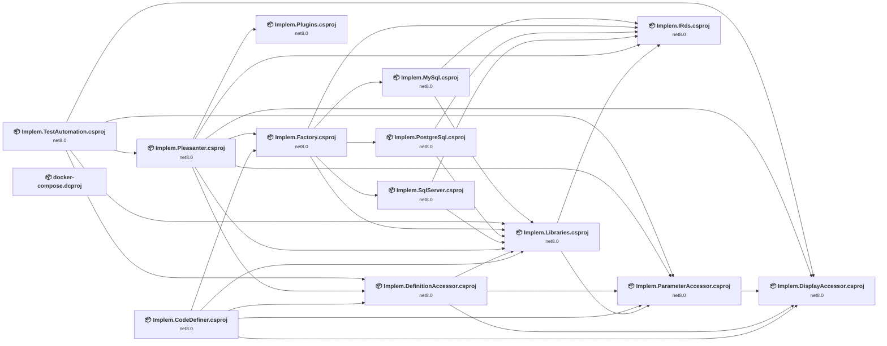

## Project Details

### docker-compose.dcproj

#### Project Info

- **Current Target Framework:** ✅
- **SDK-style**: True
- **Project Kind:** DotNetCoreApp
- **Dependencies**: 0
- **Dependants**: 0
- **Number of Files**: 0
- **Lines of Code**: 0
- **Estimated LOC to modify**: 0+ (at least 0.0% of the project)

#### Dependency Graph

Legend:
📦 SDK-style project
⚙️ Classic project

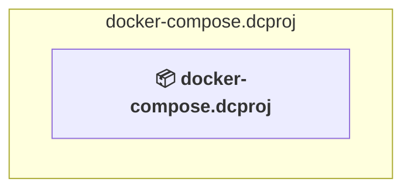

### API Compatibility

| Category | Count | Impact |
| :--- | :---: | :--- |
| 🔴 Binary Incompatible | 0 | High - Require code changes |
| 🟡 Source Incompatible | 0 | Medium - Needs re-compilation and potential conflicting API error fixing |
| 🔵 Behavioral change | 0 | Low - Behavioral changes that may require testing at runtime |
| ✅ Compatible | 0 |  |
| ***Total APIs Analyzed*** | ***0*** |  |

### Implem.CodeDefiner\Implem.CodeDefiner.csproj

#### Project Info

- **Current Target Framework:** net8.0
- **Proposed Target Framework:** net10.0
- **SDK-style**: True
- **Project Kind:** DotNetCoreApp
- **Dependencies**: 5
- **Dependants**: 0
- **Number of Files**: 47
- **Number of Files with Incidents**: 4
- **Lines of Code**: 5781
- **Estimated LOC to modify**: 19+ (at least 0.3% of the project)

#### Dependency Graph

Legend:
📦 SDK-style project
⚙️ Classic project

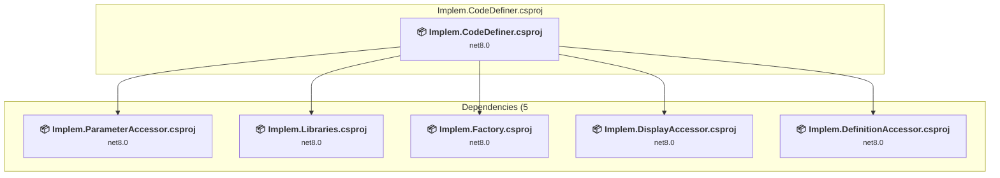

### API Compatibility

| Category | Count | Impact |
| :--- | :---: | :--- |
| 🔴 Binary Incompatible | 0 | High - Require code changes |
| 🟡 Source Incompatible | 17 | Medium - Needs re-compilation and potential conflicting API error fixing |
| 🔵 Behavioral change | 2 | Low - Behavioral changes that may require testing at runtime |
| ✅ Compatible | 5356 |  |
| ***Total APIs Analyzed*** | ***5375*** |  |

### Implem.DefinitionAccessor\Implem.DefinitionAccessor.csproj

#### Project Info

- **Current Target Framework:** net8.0
- **Proposed Target Framework:** net10.0
- **SDK-style**: True
- **Project Kind:** ClassLibrary
- **Dependencies**: 3
- **Dependants**: 3
- **Number of Files**: 4
- **Number of Files with Incidents**: 2
- **Lines of Code**: 15013
- **Estimated LOC to modify**: 1+ (at least 0.0% of the project)

#### Dependency Graph

Legend:
📦 SDK-style project
⚙️ Classic project

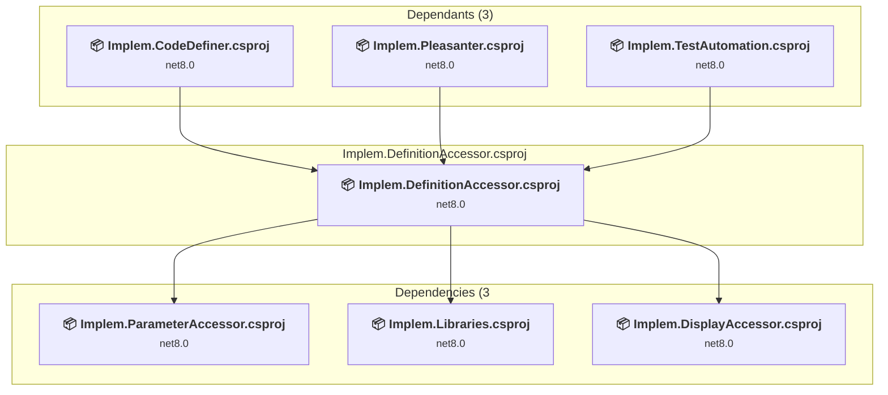

### API Compatibility

| Category | Count | Impact |
| :--- | :---: | :--- |
| 🔴 Binary Incompatible | 0 | High - Require code changes |
| 🟡 Source Incompatible | 0 | Medium - Needs re-compilation and potential conflicting API error fixing |
| 🔵 Behavioral change | 1 | Low - Behavioral changes that may require testing at runtime |
| ✅ Compatible | 38234 |  |
| ***Total APIs Analyzed*** | ***38235*** |  |

### Implem.DisplayAccessor\Implem.DisplayAccessor.csproj

#### Project Info

- **Current Target Framework:** net8.0
- **Proposed Target Framework:** net10.0
- **SDK-style**: True
- **Project Kind:** ClassLibrary
- **Dependencies**: 0
- **Dependants**: 5
- **Number of Files**: 3
- **Number of Files with Incidents**: 1
- **Lines of Code**: 46
- **Estimated LOC to modify**: 0+ (at least 0.0% of the project)

#### Dependency Graph

Legend:
📦 SDK-style project
⚙️ Classic project

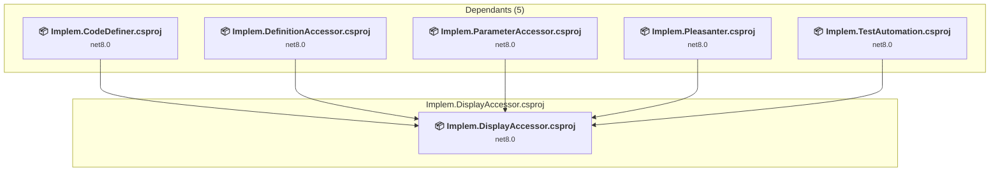

### API Compatibility

| Category | Count | Impact |
| :--- | :---: | :--- |
| 🔴 Binary Incompatible | 0 | High - Require code changes |
| 🟡 Source Incompatible | 0 | Medium - Needs re-compilation and potential conflicting API error fixing |
| 🔵 Behavioral change | 0 | Low - Behavioral changes that may require testing at runtime |
| ✅ Compatible | 14 |  |
| ***Total APIs Analyzed*** | ***14*** |  |

### Implem.Factory\Implem.Factory.csproj

#### Project Info

- **Current Target Framework:** net8.0
- **Proposed Target Framework:** net10.0
- **SDK-style**: True
- **Project Kind:** ClassLibrary
- **Dependencies**: 5
- **Dependants**: 2
- **Number of Files**: 1
- **Number of Files with Incidents**: 1
- **Lines of Code**: 25
- **Estimated LOC to modify**: 0+ (at least 0.0% of the project)

#### Dependency Graph

Legend:
📦 SDK-style project
⚙️ Classic project

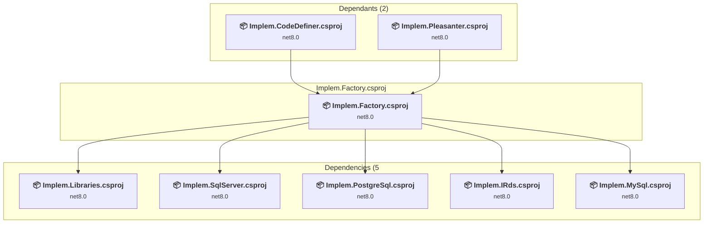

### API Compatibility

| Category | Count | Impact |
| :--- | :---: | :--- |
| 🔴 Binary Incompatible | 0 | High - Require code changes |
| 🟡 Source Incompatible | 0 | Medium - Needs re-compilation and potential conflicting API error fixing |
| 🔵 Behavioral change | 0 | Low - Behavioral changes that may require testing at runtime |
| ✅ Compatible | 12 |  |
| ***Total APIs Analyzed*** | ***12*** |  |

### Implem.Libraries\Implem.Libraries.csproj

#### Project Info

- **Current Target Framework:** net8.0
- **Proposed Target Framework:** net10.0
- **SDK-style**: True
- **Project Kind:** ClassLibrary
- **Dependencies**: 2
- **Dependants**: 8
- **Number of Files**: 70
- **Number of Files with Incidents**: 1
- **Lines of Code**: 6789
- **Estimated LOC to modify**: 0+ (at least 0.0% of the project)

#### Dependency Graph

Legend:
📦 SDK-style project
⚙️ Classic project

```mermaid
flowchart TB
    subgraph upstream["Dependants (8)"]
        P2["<b>📦&nbsp;Implem.CodeDefiner.csproj</b><br/><small>net8.0</small>"]
        P3["<b>📦&nbsp;Implem.DefinitionAccessor.csproj</b><br/><small>net8.0</small>"]
        P6["<b>📦&nbsp;Implem.Pleasanter.csproj</b><br/><small>net8.0</small>"]
        P8["<b>📦&nbsp;Implem.SqlServer.csproj</b><br/><small>net8.0</small>"]
        P9["<b>📦&nbsp;Implem.PostgreSql.csproj</b><br/><small>net8.0</small>"]
        P10["<b>📦&nbsp;Implem.Factory.csproj</b><br/><small>net8.0</small>"]
        P11["<b>📦&nbsp;Implem.TestAutomation.csproj</b><br/><small>net8.0</small>"]
        P14["<b>📦&nbsp;Implem.MySql.csproj</b><br/><small>net8.0</small>"]
        click P2 "#implemcodedefinerimplemcodedefinercsproj"
        click P3 "#implemdefinitionaccessorimplemdefinitionaccessorcsproj"
        click P6 "#implempleasanterimplempleasantercsproj"
        click P8 "#rdsimplemsqlserverimplemsqlservercsproj"
        click P9 "#rdsimplempostgresqlimplempostgresqlcsproj"
        click P10 "#implemfactoryimplemfactorycsproj"
        click P11 "#implemtestautomationimplemtestautomationcsproj"
        click P14 "#rdsimplemmysqlimplemmysqlcsproj"
    end
    subgraph current["Implem.Libraries.csproj"]
        MAIN["<b>📦&nbsp;Implem.Libraries.csproj</b><br/><small>net8.0</small>"]
        click MAIN "#implemlibrariesimplemlibrariescsproj"
    end
    subgraph downstream["Dependencies (2"]
        P4["<b>📦&nbsp;Implem.ParameterAccessor.csproj</b><br/><small>net8.0</small>"]
        P7["<b>📦&nbsp;Implem.IRds.csproj</b><br/><small>net8.0</small>"]
        click P4 "#implemparameteraccessorimplemparameteraccessorcsproj"
        click P7 "#rdsimplemirdsimplemirdscsproj"
    end
    P2 --> MAIN
    P3 --> MAIN
    P6 --> MAIN
    P8 --> MAIN
    P9 --> MAIN
    P10 --> MAIN
    P11 --> MAIN
    P14 --> MAIN
    MAIN --> P4
    MAIN --> P7

```

### API Compatibility

| Category | Count | Impact |
| :--- | :---: | :--- |
| 🔴 Binary Incompatible | 0 | High - Require code changes |
| 🟡 Source Incompatible | 0 | Medium - Needs re-compilation and potential conflicting API error fixing |
| 🔵 Behavioral change | 0 | Low - Behavioral changes that may require testing at runtime |
| ✅ Compatible | 5292 |  |
| ***Total APIs Analyzed*** | ***5292*** |  |

### Implem.ParameterAccessor\Implem.ParameterAccessor.csproj

#### Project Info

- **Current Target Framework:** net8.0
- **Proposed Target Framework:** net10.0
- **SDK-style**: True
- **Project Kind:** ClassLibrary
- **Dependencies**: 1
- **Dependants**: 5
- **Number of Files**: 72
- **Number of Files with Incidents**: 1
- **Lines of Code**: 1520
- **Estimated LOC to modify**: 0+ (at least 0.0% of the project)

#### Dependency Graph

Legend:
📦 SDK-style project
⚙️ Classic project

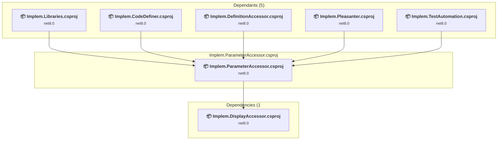

### API Compatibility

| Category | Count | Impact |
| :--- | :---: | :--- |
| 🔴 Binary Incompatible | 0 | High - Require code changes |
| 🟡 Source Incompatible | 0 | Medium - Needs re-compilation and potential conflicting API error fixing |
| 🔵 Behavioral change | 0 | Low - Behavioral changes that may require testing at runtime |
| ✅ Compatible | 1289 |  |
| ***Total APIs Analyzed*** | ***1289*** |  |

### Implem.Pleasanter\Implem.Pleasanter.csproj

#### Project Info

- **Current Target Framework:** net8.0
- **Proposed Target Framework:** net10.0
- **SDK-style**: True
- **Project Kind:** AspNetCore
- **Dependencies**: 7
- **Dependants**: 1
- **Number of Files**: 5601
- **Number of Files with Incidents**: 12
- **Lines of Code**: 409264
- **Estimated LOC to modify**: 169+ (at least 0.0% of the project)

#### Dependency Graph

Legend:
📦 SDK-style project
⚙️ Classic project

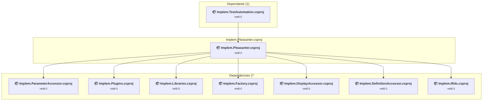

### API Compatibility

| Category | Count | Impact |
| :--- | :---: | :--- |
| 🔴 Binary Incompatible | 1 | High - Require code changes |
| 🟡 Source Incompatible | 131 | Medium - Needs re-compilation and potential conflicting API error fixing |
| 🔵 Behavioral change | 37 | Low - Behavioral changes that may require testing at runtime |
| ✅ Compatible | 200561 |  |
| ***Total APIs Analyzed*** | ***200730*** |  |

#### Project Technologies and Features

| Technology | Issues | Percentage | Migration Path |
| :--- | :---: | :---: | :--- |
| Directory Services (LDAP/Active Directory) | 124 | 73.4% | APIs for interacting with directory services like Active Directory and LDAP that are available via NuGet packages. The core functionality has been moved to separate packages. Install System.DirectoryServices (AD/LDAP), System.DirectoryServices.AccountManagement (user/group management), System.DirectoryServices.Protocols (LDAP protocol). |

### Implem.Plugins\Implem.Plugins.csproj

#### Project Info

- **Current Target Framework:** net8.0
- **Proposed Target Framework:** net10.0
- **SDK-style**: True
- **Project Kind:** ClassLibrary
- **Dependencies**: 0
- **Dependants**: 1
- **Number of Files**: 3
- **Number of Files with Incidents**: 1
- **Lines of Code**: 31
- **Estimated LOC to modify**: 0+ (at least 0.0% of the project)

#### Dependency Graph

Legend:
📦 SDK-style project
⚙️ Classic project

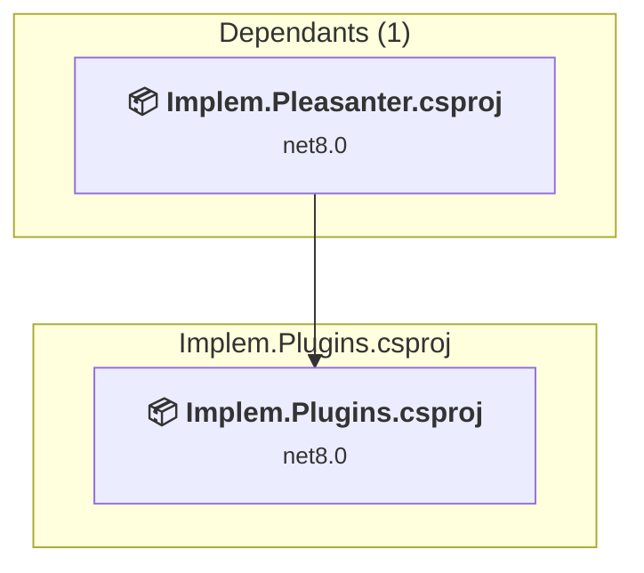

### API Compatibility

| Category | Count | Impact |
| :--- | :---: | :--- |
| 🔴 Binary Incompatible | 0 | High - Require code changes |
| 🟡 Source Incompatible | 0 | Medium - Needs re-compilation and potential conflicting API error fixing |
| 🔵 Behavioral change | 0 | Low - Behavioral changes that may require testing at runtime |
| ✅ Compatible | 26 |  |
| ***Total APIs Analyzed*** | ***26*** |  |

### Implem.TestAutomation\Implem.TestAutomation.csproj

#### Project Info

- **Current Target Framework:** net8.0
- **Proposed Target Framework:** net10.0
- **SDK-style**: True
- **Project Kind:** DotNetCoreApp
- **Dependencies**: 5
- **Dependants**: 0
- **Number of Files**: 8
- **Number of Files with Incidents**: 3
- **Lines of Code**: 1352
- **Estimated LOC to modify**: 3+ (at least 0.2% of the project)

#### Dependency Graph

Legend:
📦 SDK-style project
⚙️ Classic project

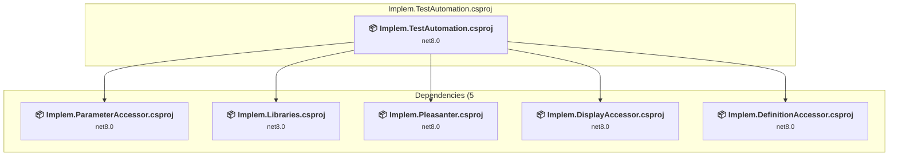

### API Compatibility

| Category | Count | Impact |
| :--- | :---: | :--- |
| 🔴 Binary Incompatible | 0 | High - Require code changes |
| 🟡 Source Incompatible | 3 | Medium - Needs re-compilation and potential conflicting API error fixing |
| 🔵 Behavioral change | 0 | Low - Behavioral changes that may require testing at runtime |
| ✅ Compatible | 1432 |  |
| ***Total APIs Analyzed*** | ***1435*** |  |

### Rds\Implem.IRds\Implem.IRds.csproj

#### Project Info

- **Current Target Framework:** net8.0
- **Proposed Target Framework:** net10.0
- **SDK-style**: True
- **Project Kind:** ClassLibrary
- **Dependencies**: 0
- **Dependants**: 6
- **Number of Files**: 12
- **Number of Files with Incidents**: 1
- **Lines of Code**: 210
- **Estimated LOC to modify**: 0+ (at least 0.0% of the project)

#### Dependency Graph

Legend:
📦 SDK-style project
⚙️ Classic project

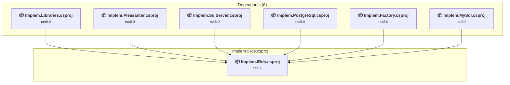

### API Compatibility

| Category | Count | Impact |
| :--- | :---: | :--- |
| 🔴 Binary Incompatible | 0 | High - Require code changes |
| 🟡 Source Incompatible | 0 | Medium - Needs re-compilation and potential conflicting API error fixing |
| 🔵 Behavioral change | 0 | Low - Behavioral changes that may require testing at runtime |
| ✅ Compatible | 186 |  |
| ***Total APIs Analyzed*** | ***186*** |  |

### Rds\Implem.MySql\Implem.MySql.csproj

#### Project Info

- **Current Target Framework:** net8.0
- **Proposed Target Framework:** net10.0
- **SDK-style**: True
- **Project Kind:** ClassLibrary
- **Dependencies**: 2
- **Dependants**: 1
- **Number of Files**: 12
- **Number of Files with Incidents**: 1
- **Lines of Code**: 1450
- **Estimated LOC to modify**: 0+ (at least 0.0% of the project)

#### Dependency Graph

Legend:
📦 SDK-style project
⚙️ Classic project

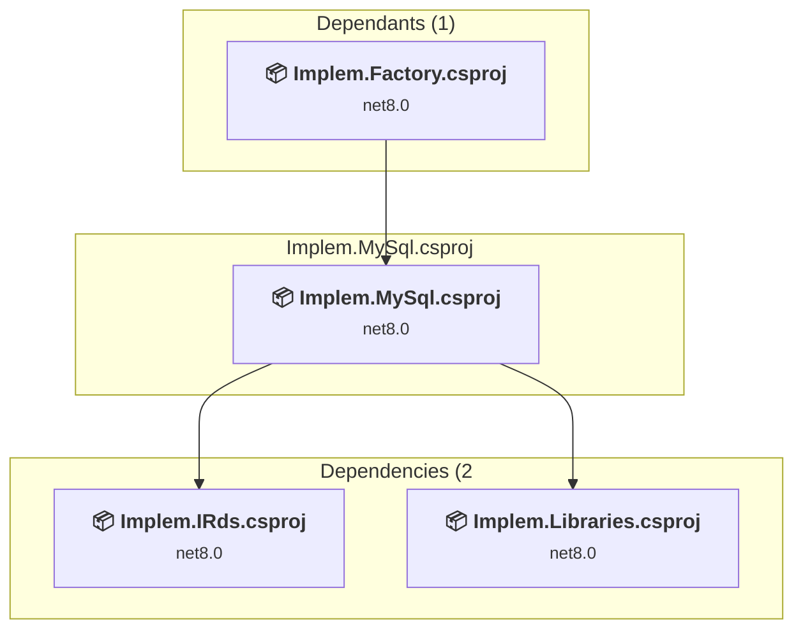

### API Compatibility

| Category | Count | Impact |
| :--- | :---: | :--- |
| 🔴 Binary Incompatible | 0 | High - Require code changes |
| 🟡 Source Incompatible | 0 | Medium - Needs re-compilation and potential conflicting API error fixing |
| 🔵 Behavioral change | 0 | Low - Behavioral changes that may require testing at runtime |
| ✅ Compatible | 812 |  |
| ***Total APIs Analyzed*** | ***812*** |  |

### Rds\Implem.PostgreSql\Implem.PostgreSql.csproj

#### Project Info

- **Current Target Framework:** net8.0
- **Proposed Target Framework:** net10.0
- **SDK-style**: True
- **Project Kind:** ClassLibrary
- **Dependencies**: 2
- **Dependants**: 1
- **Number of Files**: 12
- **Number of Files with Incidents**: 1
- **Lines of Code**: 1443
- **Estimated LOC to modify**: 0+ (at least 0.0% of the project)

#### Dependency Graph

Legend:
📦 SDK-style project
⚙️ Classic project

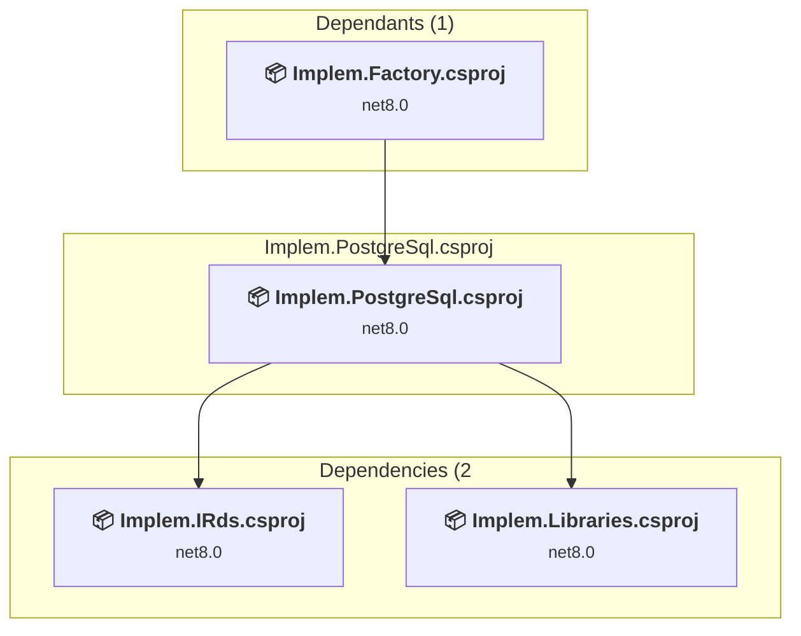

### API Compatibility

| Category | Count | Impact |
| :--- | :---: | :--- |
| 🔴 Binary Incompatible | 0 | High - Require code changes |
| 🟡 Source Incompatible | 0 | Medium - Needs re-compilation and potential conflicting API error fixing |
| 🔵 Behavioral change | 0 | Low - Behavioral changes that may require testing at runtime |
| ✅ Compatible | 821 |  |
| ***Total APIs Analyzed*** | ***821*** |  |

### Rds\Implem.SqlServer\Implem.SqlServer.csproj

#### Project Info

- **Current Target Framework:** net8.0
- **Proposed Target Framework:** net10.0
- **SDK-style**: True
- **Project Kind:** ClassLibrary
- **Dependencies**: 2
- **Dependants**: 1
- **Number of Files**: 12
- **Number of Files with Incidents**: 7
- **Lines of Code**: 1381
- **Estimated LOC to modify**: 232+ (at least 16.8% of the project)

#### Dependency Graph

Legend:
📦 SDK-style project
⚙️ Classic project

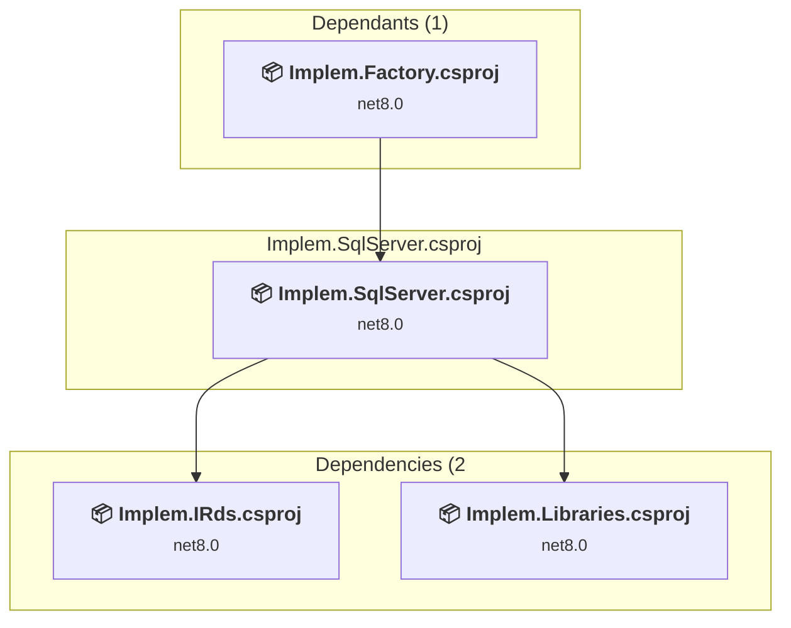

### API Compatibility

| Category | Count | Impact |
| :--- | :---: | :--- |
| 🔴 Binary Incompatible | 0 | High - Require code changes |
| 🟡 Source Incompatible | 232 | Medium - Needs re-compilation and potential conflicting API error fixing |
| 🔵 Behavioral change | 0 | Low - Behavioral changes that may require testing at runtime |
| ✅ Compatible | 535 |  |
| ***Total APIs Analyzed*** | ***767*** |  |

